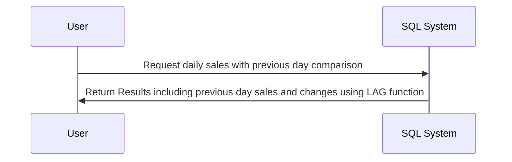

## Introduction

In the realm of data analysis, especially when dealing with time-series data, being able to compare current records with historical or future ones is vital. SQL provides **Lag** and **Lead** functions to facilitate these temporal comparisons. These are a part of the window functions, enabling more advanced data manipulation and insightful analytics. By using these, you can easily crawl through rows in a defined sequence and compute required differentials or cumulative patterns.

## Design Pattern Overview

### Lag Function

The `LAG` function in SQL allows access to prior row data without the need of self-joins. It's particularly useful when you want to compute changes over time, such as assessing sales growth.

#### Syntax

```sql
SELECT column1, column2, LAG(column2, 1, 0) OVER (ORDER BY column1) AS previous_value
FROM table_name;
```

#### Parameters:
- **column2**: The column for which the previous value is required.
- **1**: Offset number of steps to look back.
- **0**: Default value if there is no preceding row.

### Lead Function

Conversely, the `LEAD` function accesses the succeeding row in the data set, which is useful for forecasting, or comparing current values against future expected trends.

#### Syntax

```sql
SELECT column1, column2, LEAD(column2, 1, 0) OVER (ORDER BY column1) AS next_value
FROM table_name;
```

#### Parameters:
- **column2**: The column from which the next value is required.
- **1**: Offset number of steps to look forward.
- **0**: Default value if there is no subsequent row.

## Architectural Approach

Using Lag and Lead functions fits seamlessly within the broader architecture of data processing and ETL pipelines. These functions should be employed during the data transformation phase, where raw time-series data is being processed and prepared for analytical querying.

### Example Code

Below is a practical implementation example where the difference in daily sales compared to the previous day is calculated using the `LAG` function:

```sql
CREATE TABLE daily_sales (
  day DATE PRIMARY KEY,
  sales INTEGER
);

INSERT INTO daily_sales (day, sales) VALUES
('2024-01-01', 200),
('2024-01-02', 250),
('2024-01-03', 290),
('2024-01-04', 310);

SELECT day,
       sales,
       LAG(sales, 1, 0) OVER (ORDER BY day) AS previous_sales,
       sales - LAG(sales, 1, 0) OVER (ORDER BY day) AS sales_change
FROM daily_sales;
```

## Diagrams



## Best Practices

1. **Partitioning and Ordering**: Always ensure your data is correctly partitioned and ordered; this is central for LAG and LEAD functionality within window functions.
2. **Default Values**: Use default values diligently to avoid errors when there are no prior/subsequent rows.
3. **Performance Consideration**: Keep in mind that large datasets might be computationally expensive; optimize queries where possible.

## Related Patterns

- **Window Functions**: LAG and LEAD are part of a broader SQL capability called window functions, which also include functions like ROW_NUMBER, RANK, and NTILE.
- **Change Data Capture**: Often used alongside temporal queries.

## Additional Resources

- [SQL Window Functions Overview](https://www.example.com/sql-window-functions)
- [Efficient Time Series Analysis in SQL](https://www.example.com/time-series-sql)
- [Database Performance Optimization](https://www.example.com/sql-optimization)

## Summary

By adopting Lag and Lead functions in your data modeling and analysis workflows, you can efficiently address complex temporal queries and derive time-based insights in your datasets without the computational overhead of complex joins and subqueries. These functions enhance not only the expressiveness of SQL queries but also contribute significantly to writing elegant, efficient data analysis logic.
