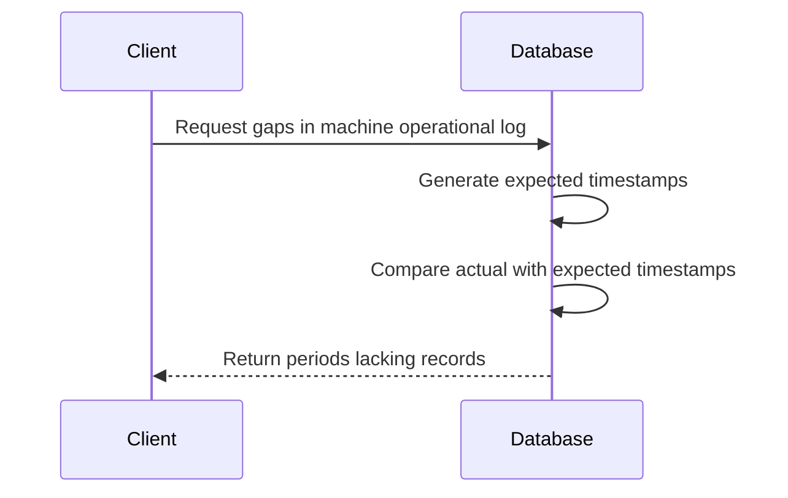

## Description

The Temporal Gap Analysis pattern is instrumental in identifying periods where data is missing or when there are no records for a particular entity over a set time frame. This technique is especially useful in scenarios such as identifying downtime in machinery, gaps in sensor data logs, or missing financial transactions. Detecting these gaps helps in maintaining data integrity, ensuring data accuracy, and enhancing temporal data analysis strategies.

## Architectural Approach

Temporal Gap Analysis primarily involves:

1. **Timestamp Handling**: Utilize precise timestamps to log each data point.
2. **Sequential Analysis**: Arrange data chronologically to facilitate gap detection.
3. **Expected Time Intervals**: Define expected intervals at which data should appear.
4. **Gap Querying**: Use mathematical and logical operations in database queries to identify intervals devoid of data.

## Best Practices

- **Regular Timestamping**: Ensure each event or datum is accurately timestamped to avoid pseudo-gaps.
- **Flexible Intervals**: Design systems to adjust expected intervals dynamically based on frequency and context of data recording.
- **Robust SQL Queries**: Construct efficient queries to identify and manage gaps without significantly impacting performance.
- **Data Validation**: Regularly validate data to ascertain the comprehensiveness of datasets.

## Example Code

### SQL Example to Identify Gaps

```sql
WITH expected_intervals AS (
  SELECT start_time + interval '5 minutes' * generate_series(0, (SELECT extract(epoch from max(end_time) - min(start_time))/300)::int)
  AS expected_time
  FROM machine_logs
),
actual_times AS (
  SELECT start_time FROM machine_logs
)
SELECT e.expected_time
FROM expected_intervals e
LEFT JOIN actual_times a
ON e.expected_time = a.start_time
WHERE a.start_time IS NULL;
```

### Explanation

- **expected_intervals CTE** generates a series of expected timestamps based on the minimum and maximum times within the `machine_logs`.
- **actual_times CTE** selects the start times from actual log records.
- The `LEFT JOIN` on expected and actual times helps to find records where there is no corresponding log entry, indicating a gap.

## Diagrams

### Sequence Diagram



## Related Patterns

- **Event Sourcing**: Ensures events are recorded to enable full state recovery, aiding in historical data integrity checks.
- **Change Data Capture (CDC)**: Useful for detecting changes over time and identifying gaps in data capture processes.

## Additional Resources

1. Martin Fowler's Analysis Patterns and Temporal Patterns: [martinfowler.com](https://martinfowler.com)
2. Temporal Data & The Relational Model by C. J. Date et al.

## Summary

Temporal Gap Analysis is a crucial design pattern in data modeling, particularly for applications requiring precise historical data tracking and integrity. It effectively helps identify data discrepancies, ensuring datasets are both complete and reliable for analysis. Implementing Temporal Gap Analysis aids in preemptive fault detection, data quality enhancements, and supports comprehensive time series analysis.
