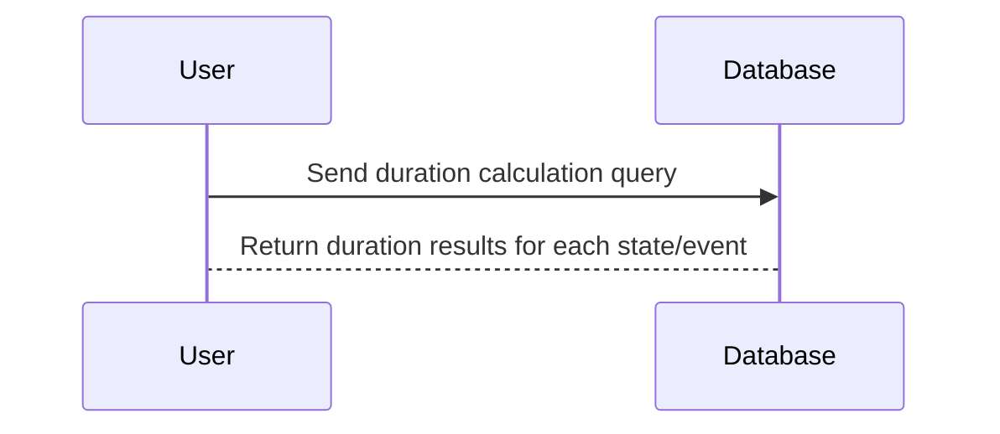

## Overview

The Duration Calculation Query pattern is an essential technique in temporal data analysis, allowing users to derive the length of time associated with specific states or events from temporal data. This pattern is applicable in various domains, including HR analytics, logistics, financial reporting, and more.

## Architectural Approach

The architectural approach to implementing the Duration Calculation Query involves several steps:

1. **Identify Relevant Data**: Start by identifying the tables or datasets containing the temporal data related to state changes or events.

2. **Normalize Temporality**: Ensure that data is normalized to include start and end timestamps for each state or event.

3. **SQL or Query Language Logic**: Use SQL or another query language to calculate the difference between start and end times to determine durations.

4. **Aggregation**: Depending on the requirements, aggregate the duration data to obtain meaningful insights, such as total time spent or average duration.

## Best Practices

- **Ensure Accurate Timestamps**: Ensure that all entries have precise and accurate timestamps to enable correct duration calculations.
  
- **Handle Overlaps**: Account for potential overlaps in states or events, which might require additional logic in the query.

- **Performance Optimization**: Optimize queries for performance, especially in large datasets, by indexing important columns like timestamps.

## Example Code

Here is an example SQL code snippet demonstrating how to calculate the duration an employee spent in each department:

```sql
SELECT 
    employee_id,
    department_id,
    SUM(TIMESTAMPDIFF(SECOND, start_time, end_time)) AS duration_seconds
FROM 
    employee_department_history
GROUP BY 
    employee_id, 
    department_id;
```

This SQL query calculates the total time, in seconds, that each employee has spent in each department by summing the differences between `start_time` and `end_time` for each record.

## Diagrams

To illustrate how the Duration Calculation Query works, consider the following sequence diagram:



## Related Patterns

- **Event Logging**: Capturing all state changes or events with timestamps to facilitate duration calculations.

- **Data Aggregation Patterns**: Techniques for summarizing data across multiple dimensions to glean insights from duration data.

- **Temporal Data Management**: Dedicated mechanisms ensuring the integrity and availability of temporal data.

## Additional Resources

- [SQL for Data Analysis: Example Queries](https://www.anexamplelink.com)
- [Optimizing Time-based Queries in Databases](https://www.anotherlink.com)

## Summary

The Duration Calculation Query pattern provides a systematic approach to deducing the duration of states or events by utilizing temporal data. This pattern is highly beneficial for deriving insights in time-based analytic scenarios. Practitioners must pay attention to data integrity, performance, and overlap handling to maximize the utility of this pattern.
