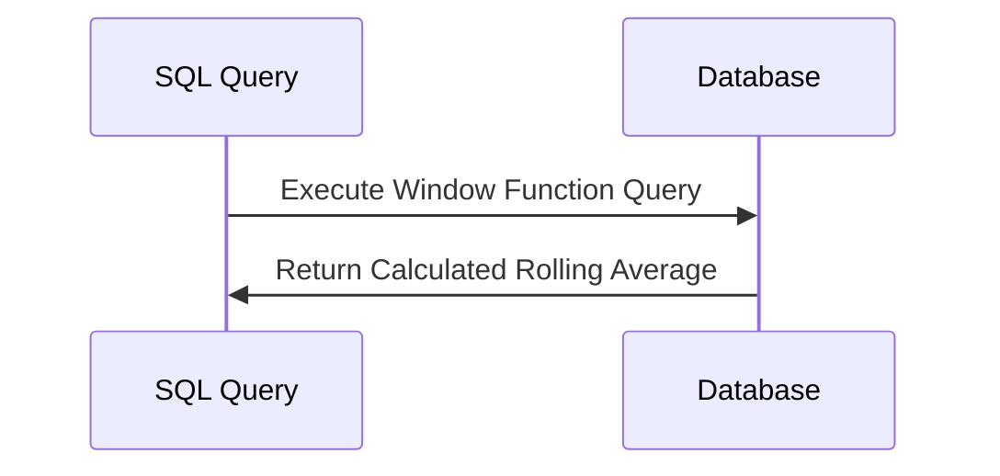

## Temporal Window Functions

### Description

Temporal Window Functions are applied to temporal data, allowing for computations over an ordered set of rows related to the current row. They are especially useful in a variety of time-based analyses, such as calculating moving averages, running totals, and other analyses that involve time or sequence-sensitive operations. Temporal window functions can handle application areas such as financial calculations, traffic analysis, and trend detection.

### Application Context

When working with datasets involving timestamps, you may need to compute aggregate metrics over a sliding window of data. Examples include calculating moving averages of website traffic, financial data, sensor readings, or sales data, where each data point is associated with a particular point in time.

### Best Practices

- Ensure data temporal alignment: Make sure that your data timestamps are aligned and consistent.
- Choose window sizes appropriately based on the expected data frequency and analysis requirements.
- Use index on the timestamp to improve query performance.
- Test in different datasets size to understand the function performance implication.

### Example Code

Here's an example in SQL using a Temporal Window Function to calculate the rolling 7-day average of website traffic.

```sql
SELECT 
    date,
    page_views,
    AVG(page_views) OVER (
        ORDER BY date 
        ROWS BETWEEN 6 PRECEDING AND CURRENT ROW
    ) AS rolling_avg_7_days
FROM 
    website_traffic
ORDER BY 
    date;
```

### Diagram



### Related Patterns

- **Sliding Window Pattern**: Utilizes similar approaches but focuses more on elements in a sliding, non-overlapping window.
- **Event Sourcing**: Uses event histories to allow time-based queries over data events.
- **Changelog Capture**: Captures and reflects changes over data, similar to maintaining temporal states.

### Additional Resources

- [Temporal Data Processing in Database Systems](https://www.example.com/temporal-data-processing)
- [SQL Window Functions: Final Complete Guide](https://www.example.com/sql-window-functions)
- [Advanced SQL: Window Functions](https://www.example.com/advanced-sql-window-functions)

### Summary

Temporal Window Functions provide a powerful abstraction for transforming and analyzing temporal datasets efficiently. By using these functions and adhering to best practices, organizations are empowered to derive actionable insights across time-sensitive data, which is crucial in numerous data-intensive applications. By strategically applying temporal window functions, you can significantly enhance the performance and value of your data analytics procedures.
