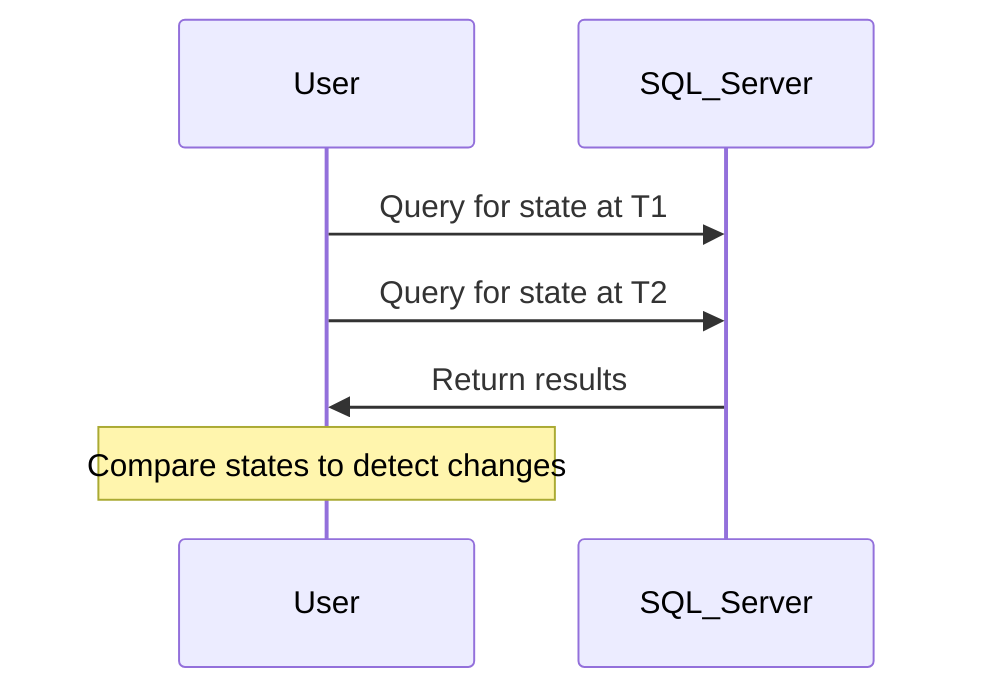

## Overview

Valid-Time State Comparison is a design pattern used in data modeling to analyze changes in datasets over time. By utilizing temporal queries, this pattern allows systems to capture, store, and compare the state of data at different points in time. This capability is vital for applications that require auditing, historical analysis, and detecting changes over defined valid time intervals.

### Core Concepts

- **Valid-Time**: A temporal aspect that represents the time period during which a fact is true within the modeled world.
- **State Comparison**: The act of analyzing two or more temporal states of data to identify discrepancies or changes.

## Architectural Approaches

### Implementation using SQL

Temporal tables in SQL databases such as PostgreSQL or SQL Server can be utilized to implement this pattern. The concept revolves around storing data with timestamp metadata and using time travel queries to retrieve data as of a particular valid time.

**SQL Server Example:**

```sql
-- Creating a temporal table
CREATE TABLE ProductCatalog
(
    ProductID int NOT NULL PRIMARY KEY,
    ProductName nvarchar(50) NOT NULL,
    ValidFrom datetime2 GENERATED ALWAYS AS ROW START,
    ValidTo datetime2 GENERATED ALWAYS AS ROW END,
    PERIOD FOR SYSTEM_TIME (ValidFrom, ValidTo)
)
WITH (SYSTEM_VERSIONING = ON);

-- Querying to compare the state at two different times
SELECT p1.ProductName
FROM ProductCatalog FOR SYSTEM_TIME AS OF '2023-01-01' AS p1
FULL OUTER JOIN ProductCatalog FOR SYSTEM_TIME AS OF '2023-01-31' AS p2
    ON p1.ProductID = p2.ProductID
WHERE p1.ProductName IS DISTINCT FROM p2.ProductName;
```

### NoSQL and Cloud Solutions

In NoSQL databases like MongoDB, versioning and change tracking can be handled at the application layer by storing states with explicit valid-time metadata. On cloud platforms, services like BigQuery provide built-in functions for time-partitioned data enabling similar time travel queries.

### Diagram



## Example Use Cases

- **Auditing**: Compare the state of financial transactions to detect discrepancies over time.
- **Product Life Cycle**: Track changes to a product catalog, identifying new, modified, or retired products.
- **Data Validation**: Ensure data integrity by verifying consistent data entries over time.

## Related Patterns

- **Temporal Validity**: Involves handling the validity of data relative to both user-defined valid-time and transaction-time.
- **Slowly Changing Dimensions (SCD)**: A methodology for dealing with changes in data warehousing and dimensional modeling.
- **Bitemporal Modeling**: An advanced temporal modeling technique that separately tracks valid-time and transaction-time.

## Additional Resources

- [Temporal Table Queries in SQL](https://docs.microsoft.com/en-us/sql/relational-databases/tables/temporal-tables)
- [Time-series Data Handling with BigQuery](https://cloud.google.com/bigquery/docs/reference/standard-sql/query-syntax#time_travel)
- [NoSQL Data Modeling with MongoDB](https://docs.mongodb.com/)

## Summary

The Valid-Time State Comparison design pattern is essential for applications that require understanding changes over time. This capability offers robust solutions for auditing, historical analysis, and monitoring dynamic datasets. Through careful implementation using appropriate database technologies and cloud platforms, organizations can gain valuable insights into temporal data changes.
