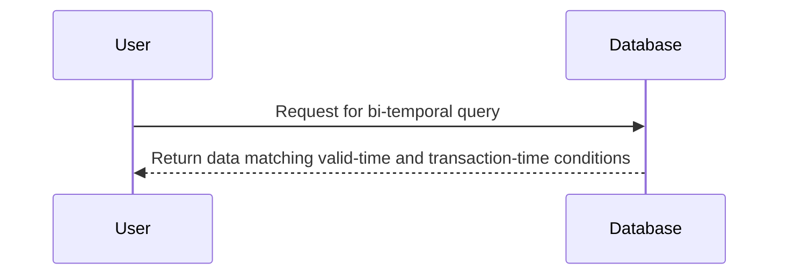

Bi-Temporal querying is a design pattern in database systems that allows users to query data based on both its **valid-time** and **transaction-time** dimensions. This pattern is critical for applications that require tracking changes over time for auditing, temporal analytics, or historical data restoration.

## Key Concepts

- **Valid-Time**: The period during which a fact was true in the real world.
- **Transaction-Time**: The time when the data was stored in the database.

These two time dimensions allow databases to maintain comprehensive records of data changes over time, providing historical data views that reflect both the reality and when the data was known.

## Architectural Approaches

To implement bi-temporal querying, it’s necessary to design data models that capture both valid-time and transaction-time aspects:

1. **Temporal Tables**: Use of tables with additional columns to store time intervals.
2. **Audit Logs**: Maintain a separate log table with historical records for auditing purposes.
3. **Database Schemas**: Modify schema designs to incorporate time columns, such as `validFrom`, `validTo`, `transactionFrom`, `transactionTo`.

## Example Code

Here’s an example using SQL to create a bi-temporal table and perform a query:

```sql
CREATE TABLE CustomerHistory (
    CustomerID INT,
    Name VARCHAR(255),
    Address VARCHAR(255),
    ValidFrom DATE,
    ValidTo DATE,
    TransactionFrom DATE DEFAULT CURRENT_DATE,
    TransactionTo DATE DEFAULT '9999-12-31'
);

-- Query to retrieve customer data as known on '2023-01-01' and valid on '2022-12-01'
SELECT * FROM CustomerHistory
WHERE '2023-01-01' BETWEEN TransactionFrom AND TransactionTo
AND '2022-12-01' BETWEEN ValidFrom AND ValidTo;
```

In this example, `CustomerHistory` captures both historical and current states of customer data.

## Diagrams

### Sequence Diagram



## Best Practices

- **Normalization**: Avoid redundant data by properly normalizing temporal attributes.
- **Indexing**: Use indexing strategies to improve query performance on temporal columns.
- **Data Compression**: Implement data compression techniques to manage storage for historical data.
- **Governance**: Define policies for data retention and archival for managing past data.

## Related Patterns

- **Uni-Temporal Querying**: Focuses on either valid-time or transaction-time.
- **Snapshot Isolation**: Provides a view of data at a particular point in time.
- **Event Sourcing**: Captures all changes to the system as a sequence of events.

## Additional Resources

- [SQL:2011 Standard Documentation](https://en.wikipedia.org/wiki/SQL:2011)
- *Temporal Data & the Relational Model* by C. J. Date, Hugh Darwen, Nikos A. Lorentzos
- [Bi-temporal Data Management](https://www.tutorialspoint.com/temporal_database/temporal_database_quick_guide.htm)

## Summary

Bi-Temporal querying is an essential pattern for systems requiring reliable historical data retrieval. By incorporating both valid-time and transaction-time, it ensures accuracy and consistency. Leveraging best practices and understanding the supporting architectural patterns can enhance data models for extensive temporal analysis.
