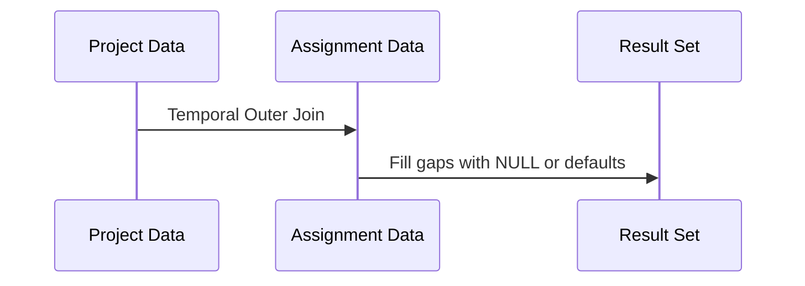

## Overview

The Temporal Outer Join pattern is designed to address scenarios wherein data from multiple tables must be joined based on time periods, allowing for gaps to be filled. This pattern is especially useful when working with time-series data where records may not align due to temporal discrepancies or missing data.

## Problem Statement

In many business scenarios, data is associated with time periods or intervals, such as contracts, project timelines, or assignments. When joining such datasets, records with non-overlapping intervals may result in incomplete data representations. For example, merging employee assignments with project timelines requires creating a comprehensive view even if an employee's role does not cover the entire project period.

## Applicability

This pattern is applicable when:

- Joining datasets with temporal dimensions such as start and end times.
- Needing to fill in temporal data gaps in analytical reports and data visualizations.
- Working with historical data where synchronization between time periods is necessary.

## Architectural Approaches

1. **Temporal Joins in SQL**: 
   - Using SQL's powerful window functions, CTEs (Common Table Expressions), and outer join clauses, you can construct queries that align records based on their temporal details while filling gaps with null or default values.

2. **Data Lakes and Warehouses**:
   - Utilize big data platforms like Snowflake or Apache Data Fusion, which support scalable processing of large temporal data sets.

3. **Partitioning and Indexing**:
   - Implement appropriate partitioning and indexing strategies to optimize queries involving large time dimensions, ensuring efficient data retrieval.

## Example Code

### SQL Example

```sql
WITH Project_Timeline AS (
  SELECT 
    project_id, 
    project_name, 
    start_date AS project_start, 
    end_date AS project_end
  FROM projects
),
Employee_Assignments AS (
  SELECT 
    employee_id, 
    assignment_id, 
    project_id,
    start_date AS assignment_start, 
    end_date AS assignment_end
  FROM assignments
)
SELECT 
  p.project_id, 
  p.project_name, 
  a.employee_id, 
  COALESCE(a.assignment_start, p.project_start) AS start_period,
  COALESCE(a.assignment_end, p.project_end) AS end_period
FROM Project_Timeline p
LEFT JOIN Employee_Assignments a
ON p.project_id = a.project_id
AND a.assignment_start <= p.project_end
AND a.assignment_end >= p.project_start
ORDER BY p.project_id, start_period;
```

## Diagram



## Related Patterns

- **SCD (Slowly Changing Dimensions)**: Deals with slowly evolving data over time.
- **Temporal Tables**: Built-in support for maintaining historical data.
- **Time Bucket Join**: Batch processing by time intervals for large datasets.

## Additional Resources

- [Temporal Table Support in SQL](https://docs.microsoft.com/en-us/sql/relational-databases/tables/temporal-tables)
- [Snowflake Time Travel](https://docs.snowflake.com/en/user-guide/timetravel)
- [Deep Dive into SQL Joins](https://www.sqltutorial.org/sql-joins/)

## Summary

The Temporal Outer Join pattern is an indispensable strategy for managing and reconciling temporal datasets, especially where discrepancies or data gaps exist. By leveraging SQL querying capabilities or big data solutions like Snowflake, individuals can maintain cohesive and accurate temporal views. This not only enhances consistency but also drives analytical insight through time-enhanced data visualization and reporting.
