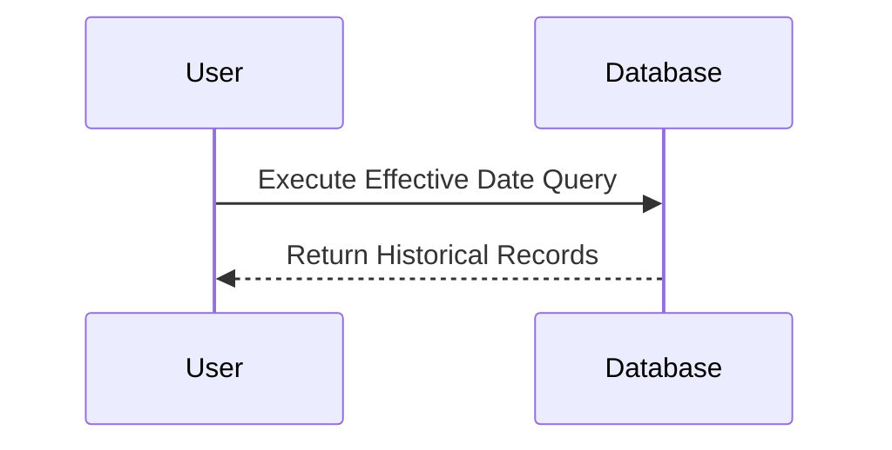
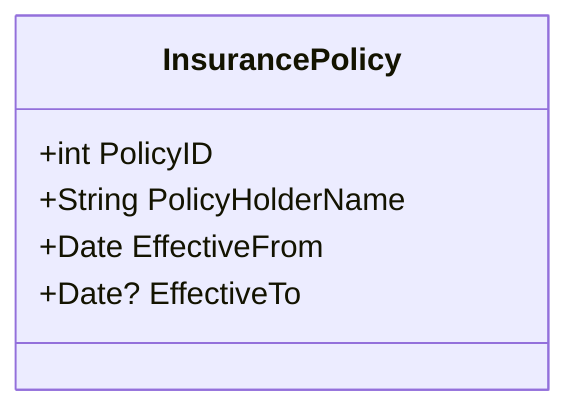

## Overview

The Effective Date Query is a design pattern primarily used for querying historical data that is accurate to a specific date. This pattern is highly useful in various domains such as finance, insurance, and compliance, where a need often arises to understand the state of data at a particular point in time.

## Architectural Approaches

In implementing effective date queries, it is crucial to properly model and manage data. There are several architectural approaches to consider:

1. **Temporal Tables**: Utilize database features that support temporal tables which record the time range when a record is valid.
2. **Effective-to and Effective-from Dates**: Add two columns to your table to represent the effective start and end dates, allowing queries to filter records based on these dates.
3. **Snapshot Tables**: Create periodic snapshots of your tables that capture the data state at specific points in time.
4. **Change Data Capture (CDC)**: Implement CDC mechanisms to track changes over time and query based on these captured changes.

## Example Code

Here's a simple example illustrating a table schema and query using effective dates:

### Table Schema

```sql
CREATE TABLE InsurancePolicy (
    PolicyID INT PRIMARY KEY,
    PolicyHolderName VARCHAR(255),
    EffectiveFrom DATE,
    EffectiveTo DATE
);
```

### Query Example

To find all policies effective as of December 31, 2022:

```sql
SELECT * FROM InsurancePolicy
WHERE '2022-12-31' BETWEEN EffectiveFrom AND IFNULL(EffectiveTo, '9999-12-31');
```

## Diagrams

### Effective Date Query Sequence Diagram



### Effective Date Query Class Diagram



## Best Practices

1. **Utilize Database Features**: Leverage database-specific temporal features or use well-indexed metadata to improve query performance.
2. **Handle Nulls and Infinite Dates**: Properly manage nulls and maximum dates in EffectiveTo to denote currently valid records.
3. **Testing and Validation**: Establish comprehensive testing strategies, including unit tests focusing on different effective date scenarios.
4. **Optimize Query Performance**: Use indexing effectively on date columns to optimize query performance.

## Related Patterns

- **Snapshot Pattern**: Helps in comparing datasets over different points in time by storing point-in-time snapshots.
- **Change Data Capture (CDC)**: Provides mechanisms to detect and capture changes in the data.
- **Temporal Pattern**: Used to model time-related aspects of data and manage changes over time.

## Additional Resources

- [Temporal Tables in SQL Server](https://docs.microsoft.com/en-us/sql/relational-databases/tables/temporal-tables)
- [Change Data Capture in MySQL](https://dev.mysql.com/doc/refman/8.0/en/replication-cdc.html)
- [Designing Data-Intensive Applications by Martin Kleppmann](https://dataintensive.net/)

## Summary

The Effective Date Query pattern is essential for systems that require access to historical data that reflects specific validations or state at a given time. Successfully implementing this pattern involves choosing the right data modeling strategy, such as temporal tables or effective date columns, complemented by rigorous testing and performance optimization to meet business requirements.
