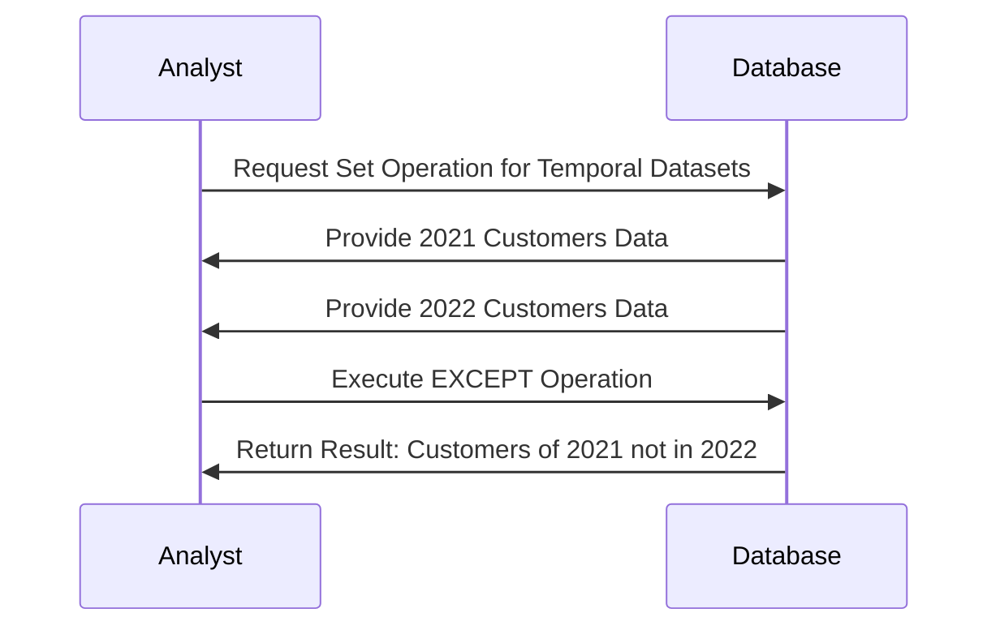

## Overview

Temporal Set Operations involve performing classic set operations—such as UNION, INTERSECT, and EXCEPT (or MINUS)—on datasets with temporal or time-based constraints. This pattern is crucial for analyzing changes over specific periods, discovering how datasets evolve, and enabling effective time-based analytics.

## Architectural Approach

Applying temporal set operations typically involves the following steps:

1. **Data Preparation**: Ensure datasets are time-stamped or versioned.
2. **Data Partitioning**: Split data by periods of interest (e.g., yearly, quarterly).
3. **Set Operations**: Apply SQL-like set operations on these temporal partitions.
4. **Temporal Alignment**: Align datasets based on common temporal keys to ensure meaningful operations.

## Paradigms and Best Practices

- **Time-stamping**: Always store a timestamp or version number with records to facilitate accurate temporal queries.
- **Consistent Time Intervals**: Maintain uniform intervals between datasets (e.g., yearly, monthly) for accurate comparison.
- **Indexing**: Use indexes on time columns to optimize query performance.
- **Data Versioning**: Maintain historical data versions, enabling analysis across time slices.

## Example Code

Below is an example using SQL for determining customers who made purchases in 2021 but not in 2022.

```sql
-- Example SQL Statement for EXCEPT Operation
SELECT customer_id
FROM purchases
WHERE purchase_date BETWEEN '2021-01-01' AND '2021-12-31'
EXCEPT
SELECT customer_id
FROM purchases
WHERE purchase_date BETWEEN '2022-01-01' AND '2022-12-31';
```

### Using Temporal Tables in SQL

For databases supporting temporal tables (e.g., SQL Server, Oracle), you might maintain a temporal table and perform operations like:

```sql
-- Assuming temporal table 'customer_purchases' with system-versioned history
SELECT customer_id
FROM customer_purchases
FOR SYSTEM_TIME AS OF '2021-12-31'
MINUS
SELECT customer_id
FROM customer_purchases
FOR SYSTEM_TIME BETWEEN '2022-01-01' AND '2022-12-31';
```

## Diagrams

The following sequence diagram illustrates the process of performing a temporal EXCEPT operation:



## Related Patterns

- **Temporal Table Pattern**: Utilize system-versioned tables for seamless temporal queries.
- **Slowly Changing Dimensions**: Particularly Type 2, often used in data warehouses to track changes over time.
- **Event Sourcing**: Capture each change as an event, often utilized in CQRS.

## Additional Resources

- [Temporal Data Management in RDBMS](https://www.example.com)
- [Understanding SQL Temporal Tables](https://www.example.com)
- [Effective Use of Set Operations in Databases](https://www.example.com)

## Summary

Temporal Set Operations enable robust analytics through time, providing insights into user behavior, business performance, and data trends over periods. By leveraging time-based constraints and efficient SQL operations, businesses can extract nuanced intelligence from their historical data, enhancing strategic decision-making processes.
