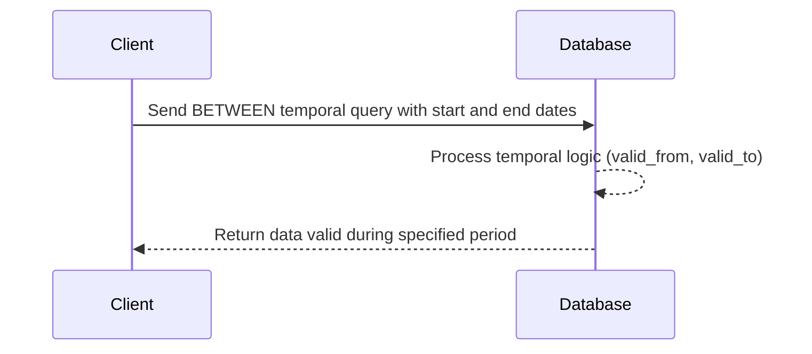

## Description

The Between Temporal Query is a design pattern used to fetch data that was valid during a specific period, marked by both start and end dates. This pattern is integral to applications dealing with temporal data, where it is necessary to retrieve information as it was within a particular timeframe. An example use case is querying for product prices that were effective during a specific period, such as between June 1, 2022, and August 31, 2022.

## Architectural Approaches

Implementing Between Temporal Queries requires handling temporal data storage and querying effectively. The approaches can be executed using SQL and NoSQL databases that support time-based querying. 

### SQL Databases

In traditional relational databases, temporal aspects can be managed by adding `valid_from` and `valid_to` columns to tables. Using these columns, one can seamlessly perform SQL queries utilizing the `BETWEEN` clause.

```sql
SELECT *
FROM product_prices
WHERE valid_from <= '2022-08-31' AND valid_to >= '2022-06-01';
```

### NoSQL Databases

For NoSQL databases like Cassandra, which lack native support for temporal queries, similar strategies using timestamps or date-like string fields can be used to capture temporal data. Queries are done utilizing range operations on those fields.

## Paradigms

Implementing Between Temporal Queries often involves several paradigms:

1. **Time-Oriented Data Management**: Focuses on capturing changes over time, such as prices, states of entities, or other temporal attributes.
   
2. **Versioning**: Involves creating different data versions, where each version of a record corresponds to a valid period.

## Best Practices

- Ensure timestamps are stored in UTC to avert potential timezone issues.
- Include meaningful indexes on temporal columns to enhance query performance.
- When designing schemas, consider future query patterns to avoid schema migrations.

## Example Code

Here's a simplified demonstration using a Scala application with a SQL database:

```scala
import java.sql.{Connection, DriverManager, ResultSet}

val connection = DriverManager.getConnection("jdbc:your_database_url", "username", "password")

val start = "2022-06-01"
val end = "2022-08-31"

val query = s"""
  SELECT * FROM product_prices
  WHERE valid_from <= '$end' AND valid_to >= '$start';
"""

val statement = connection.createStatement()
val resultSet: ResultSet = statement.executeQuery(query)

while (resultSet.next()) {
    println(resultSet.getString("product_id") + " " + resultSet.getString("price"))
}
```

## Diagrams

Below is a sequence diagram illustrating the flow for querying a temporal database:



## Related Patterns

- **Snapshot Query**: Retrieves the state of data at an exact point in time.
- **Audit Trail**: Captures the full history of changes to the data over time.
  
## Additional Resources

- **[Time-Travel Queries in Postgres](https://www.postgresql.org/docs/current/queries-with.html)**
- **[Temporal Database Wikipedia](https://en.wikipedia.org/wiki/Temporal_database)**
- **[Using Time Series Databases](https://www.toptal.com/software/time-series-databases)**

## Summary

The Between Temporal Query design pattern is crucial for systems engaging with time-sensitive data, providing mechanisms to extract information valid within specific intervals. Implemented correctly, it offers robust insights into past data, aiding in effective decision-making and analytical processes.
