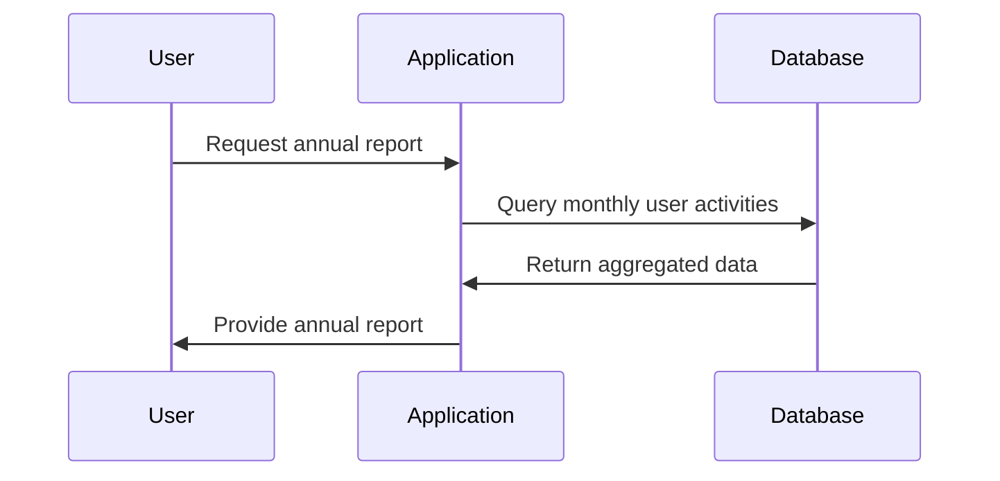

## Temporal Projection

Temporal Projection is a crucial design pattern for turning temporal (time-based) data into a non-temporal, derived state, facilitating effective analysis and reporting. It plays a particularly important role in applications requiring summarizations, such as generating an annual report from monthly data.

### Detailed Explanation

### Design Pattern Architecture
Temporal Projection involves querying time-dependent data and transforming it into a summary or aggregated form that lacks inherent time dependency, making it easier to analyze trends and changes over pre-defined periods.

#### Key Concepts
- **Temporal Data**: Data that includes aspects of time, such as timestamps or time intervals.
- **Non-Temporal Representation**: A summarized format of temporal data that removes or simplifies the aspect of time.
- **Projection**: The process of transforming and reducing data complexity while maintaining essential trends and characteristics.

### Architectural Approaches

1. **Aggregation**: Use SQL aggregate functions (e.g., `SUM`, `COUNT`, `AVG`) to condense detailed temporal data into broader summaries.
  
2. **Window Functions**: Utilize OLAP window functions available in SQL to handle rolling calculations over specified time ranges.
  
3. **ETL Pipelines**: Establish Extract, Transform, Load (ETL) practices to preprocess temporal data, creating snapshot tables for fast access.

4. **Time-Series Databases**: Consider employing databases like InfluxDB or TimescaleDB, designed for efficiently querying temporal data.

### Example Code: SQL-Based Temporal Projection

```sql
-- Example: Project monthly user activity into an annual report
SELECT 
    YEAR(activity_date) AS year,
    COUNT(DISTINCT user_id) AS annual_active_users
FROM 
    user_activity
WHERE 
    activity_date BETWEEN '2023-01-01' AND '2023-12-31'
GROUP BY 
    YEAR(activity_date);
```

This example uses SQL to project user activity over a year, summarizing monthly data into an annual report.

### Diagrams



### Related Patterns

- **Snapshot Pattern**: Captures the state of data at regular intervals for historical comparisons.
  
- **Event Sourcing Pattern**: Stores all changes to data as events and allows reconstruction of state by replaying these events.
  
- **Stateful Stream Processing**: Useful in real-time processing and aggregation directly on streams.

### Best Practices

- Ensure data integrity through time normalization and accurate timestamp handling.
- Optimize query performance with appropriate indexing and partitioning strategies on timestamp fields.
- Use materialized views or cache derived summaries to expedite frequent read operations.

### Additional Resources

- [Temporal Data & Analytics](https://www.oreilly.com/library/view/temporal-data-analytics/9781492057833/)
- [Time-Series Indexing Techniques](https://www.datastax.com/resources/whitepapers/indexing-time-series-data)

### Summary

Temporal Projection transforms time-based data into actionable insights by eliminating time after the fact while maintaining a comprehensive view of data flows. This design pattern bridges the gap between time-accumulated data complexities and the clarity of trend-based reporting, effectively supporting data-driven decision-making.

By integrating Temporal Projection into your architectural design, you can streamline analytical processes, gain deeper insights, and optimize reporting workflows efficiently.
