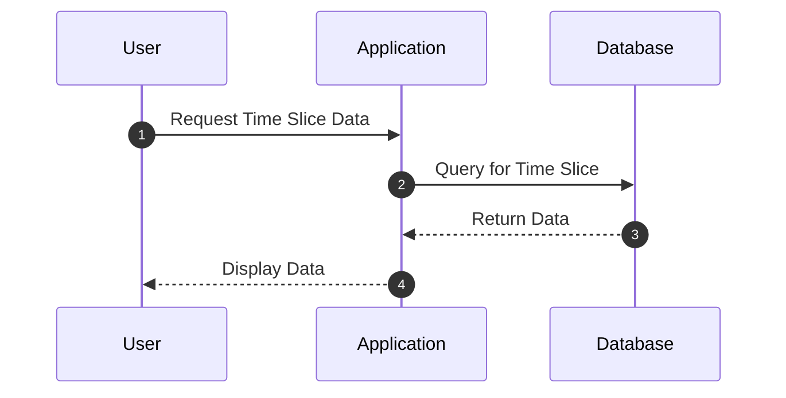

## Time Slice Query

### Description
The Time Slice Query pattern enables the extraction of data for a specific time slice across multiple entities. This pattern is particularly useful in scenarios where you need to analyze or compare historical data points, such as assessing the state of business operations at the close of business on previous days.

### Architectural Approach
Implementing Time Slice Queries typically involves setting up a temporal data model where each record includes an associated timestamp. In databases that support time travel directly, such as temporal tables in SQL, this is relatively straightforward. In systems without native temporal support, such as some NoSQL databases, you may need to handle temporal aspects within your application logic or modeling layer.

### Key Concepts
- **Temporal Data Models**: Adds a timeline context to entities by retaining historical records.
- **Snapshot Isolation**: Ensures retrieved data represents an accurate state as of the specified time.
- **Time Travel Queries**: SQL extensions or queries on temporal databases allow retrieval of stateful data at distinct points in time.

### Example Code
Here is an example using SQL's AS OF feature for a database that supports temporal tables:

```sql
SELECT order_id, status, total_amount
FROM orders FOR SYSTEM_TIME AS OF '2023-07-06T23:59:59'
WHERE status = 'completed';
```

For databases without native temporal support, a similar result can be achieved by explicitly storing timestamps:

```sql
SELECT order_id, status, total_amount
FROM orders
WHERE timestamp <= '2023-07-06T23:59:59'
AND (order_id, timestamp) IN (
  SELECT order_id, MAX(timestamp)
  FROM orders
  WHERE timestamp <= '2023-07-06T23:59:59'
  GROUP BY order_id
);
```

### Diagrams
Here is a UML sequence diagram showcasing a typical flow for executing a Time Slice Query:



### Best Practices
- Ensure indexing on time-related columns to optimize query performance.
- Use versioned tables or snapshot functionalities provided by modern databases.
- Consider using partitions to efficiently handle large datasets over time.

### Related Patterns
- **Event Sourcing**: Captures intent by storing a sequence of events that trigger data state changes.
- **Temporal Validity**: Manages data as periods of validity to capture history.
- **Change Data Capture (CDC)**: Detects data changes during specific periods.

### Additional Resources
- [SQL:2011 Standard Overview](https://en.wikipedia.org/wiki/SQL:2011)
- [Temporal Tables in SQL Server](https://docs.microsoft.com/en-us/sql/relational-databases/tables/temporal-tables)
- [Time Travel in Delta Lake](https://delta.io/blog/2020-02-24-delta-lake-time-travel/)

### Summary
Time Slice Queries provide a powerful means to analyze historical data by presenting the state of data entities at specific points in time. Leveraging this pattern enables businesses to effectively audit, replicate, and understand their historical data, thereby informing strategic decision-making processes. Proper implementation and optimization of these queries are crucial for maximizing performance and accuracy in temporal data analysis.
