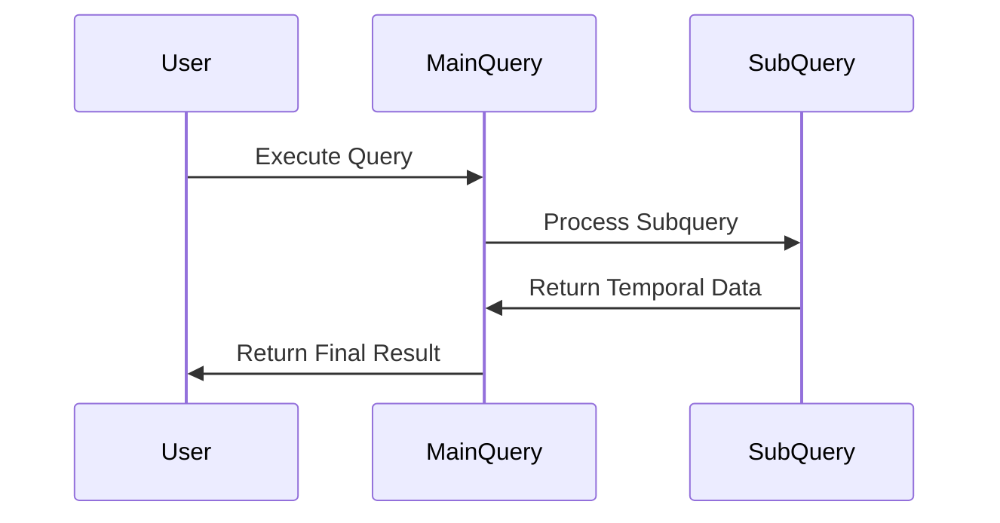

## Temporal Subquery

### Introduction

In data modeling and querying, temporal subqueries are a powerful pattern allowing for complex time-based data retrieval. This pattern leverages subqueries within a SQL query to apply temporal conditions, effectively filtering and computing datasets over specific periods. Temporal subqueries are useful for tasks such as auditing, reporting, maintaining historical data integrity, and analyzing changes over time.

### Design Pattern Explained

Temporal subqueries are constructed by embedding a SQL subquery in the `WHERE` or `FROM` clause, with temporal conditions applied to the selected columns. These conditions typically involve date and time functions to specify a point or range in time relevant to the data in question.

### Key Components
- **Subquery**: A query nested within another SQL query.
- **Temporal Conditions**: Conditions based on time, using SQL date and time functions.
- **Main Query**: The outer query that uses the results of the subquery.

### Example

Suppose you have a database of employee records with details about promotions, and you need to find employees who have not been promoted in the last five years. The temporal subquery can handle this efficiently:

```sql
SELECT e.employee_id, e.name, e.last_promotion_date
FROM employees e
WHERE e.employee_id IN (
    SELECT employee_id
    FROM employees
    WHERE last_promotion_date < DATE_SUB(CURRENT_DATE, INTERVAL 5 YEAR)
);
```

### Mermaid UML Sequence Diagram

To visualize how these components interact within this pattern, consider a sequence diagram showing the flow of data:



### Best Practices

- **Indexing**: Ensure temporal columns are indexed for performance.
- **Efficiency**: Use only necessary columns to minimize the overhead on the database.
- **Precision**: Use appropriate date/time data types (e.g., `DATE`, `TIMESTAMP`) for accuracy.
- **Validation**: Update and validate date fields to avoid logical errors in temporal queries.

### Related Patterns

- **Change Data Capture (CDC)**: Captures changes made to data in real-time.
- **Temporal Validity**: Manages and queries data within valid periods.

### Additional Resources

- [Temporal Tables in SQL Server](https://docs.microsoft.com/en-us/sql/relational-databases/tables/temporal-tables-overview?view=sql-server-ver15)
- [Date and Time Functions in SQL](https://www.w3schools.com/sql/sql_dates.asp)

### Summary

The temporal subquery pattern is invaluable in scenarios requiring analysis of data changes over time. By embedding subqueries with time-based logic within larger queries, you can efficiently query historical data, audit trails, and time-specific analytics. This approach fosters a structured and efficient methodology for temporal data handling. Applying best practices like indexing and precision usage enhances performance and accuracy in using temporal subqueries.
