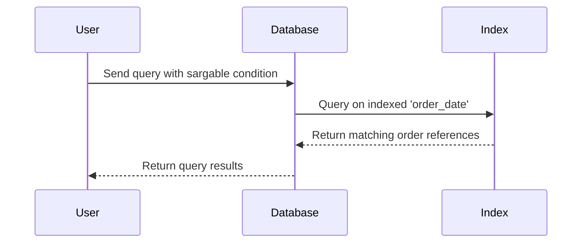

## Overview

When dealing with temporal data in databases, performance can become a severe concern, especially when a dataset grows to a massive scale. The **Sargable Temporal Query** pattern emerges as an effective strategy to ensure that temporal queries can utilize database indexes, leading to improved query performance.

**Sargability** — an abbreviation of "Search ARGument ABLE" — is a property that determines whether a database engine can take advantage of indexing to accelerate the execution of a query. In the context of temporal queries, writing sargable queries involves structuring queries with conditions on temporal columns such that they remain conducive to index usage.

## Key Concepts

### Temporal Queries

Temporal queries are those that involve time-based data, often requiring filtering based on specific time ranges or intervals. Such queries are critical in scenarios like time-series analysis, auditing, and data versioning.

### Sargable Conditions

Conditions are sargable when they allow the query planner to utilize an index effectively, typically involving comparisons such as `=`, `>`, `<`, `>=`, `<=`, and `BETWEEN`. Functions or arithmetic operations applied directly to indexed columns can render queries non-sargable.

### Indexing

Indexing involves creating a data structure that improves the speed of data retrieval operations. In the context of temporal queries, indexing columns used in time-based conditions is crucial for performance.

## Example

Consider a table `orders` that contains a timestamp column `order_date`. To construct a sargable temporal query, ensure you use the indexed column directly in the condition:

```sql
-- Sargable query example
SELECT *
FROM orders
WHERE order_date BETWEEN '2024-01-01' AND '2024-01-31';
```

This query can efficiently use an index on `order_date`. In contrast, a non-sargable version might unnecessarily involve functions:

```sql
-- Non-sargable query example
SELECT *
FROM orders
WHERE DATE(order_date) = '2024-01-01';
```

Applying the `DATE` function to `order_date` invalidates the use of any potential index on that column.

## Diagram

Here's a simple sequence explaining the data retrieval process when using a sargable query:



## Best Practices

- **Index key columns:** Ensure that the temporal properties (e.g., `order_date`) used frequently in queries are indexed.
- **Avoid functions on columns:** Refrain from using functions directly on indexed columns within query conditions.
- **Use Range Queries:** Leverage range conditions (`BETWEEN`, `>=`, `<=`) on indexed temporal columns when filtering on time ranges.
- **Monitor and tune:** Use database profiling tools to identify slow queries and refactor them to be sargable.

## Related Patterns

- **Indexing Design Pattern**: Discussing general best practices for indexing in databases.
- **Time-Series Data Management**: Approaches for dealing with dataset evolution by preserving past states.
- **Query Optimization Techniques**: Broader optimizations beyond sargable requisites including statistics and query planning.

## Resources

- [Database Indexing Best Practices](https://docs.oracle.com/en/database/indexing.html)
- [Improving Query Performance](https://www.ibm.com/docs/en/db2-query-performance)
- [SQL Server Query Optimization](https://www.microsoft.com/sql-server/docs)

## Summary

The **Sargable Temporal Query** pattern is crucial for efficient temporal data management in SQL-based systems. By ensuring queries remain sargable, developers can leverage indexing to maintain optimal performance even as datasets grow in both volume and temporal complexity. This pattern underlines a crucial aspect of SQL performance tuning and should be a critical consideration for designing responsive temporal data queries.
