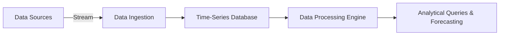

## Overview

Time-series analysis is a fundamental pattern in data analysis that involves statistical methods aimed at analyzing data points collected at successive, evenly spaced points in time. This type of data is ubiquitous in sectors like finance, meteorology, and sales, where its analysis aids in forecasting, detecting seasonal patterns, and understanding long-term trends.

## Design Pattern Context

Time-series analysis queries are pivotal in understanding temporal datasets where the order of data points is significant. The direct relationships between observations over time enable analyses such as trend detection, cyclical pattern identification, and forecasting.

## Architectural Approach

Time-series databases like Apache Druid, InfluxDB, and TimescaleDB are specially tailored for handling time-series data efficiently. These databases offer optimizations in data storage, support for advanced querying features like continuous queries, and convenient down-sampling options to manage the growth of data size.

Here is a high-level architecture for handling time-series data:

1. **Data Ingestion**: Time-series data might come from a variety of sources such as IoT devices, financial tickers, or log files. Tools like Apache Kafka can be used for real-time streaming data ingestion.
2. **Database Storage**: Once ingested, data can be stored in specialized time-series databases, which offer high performance for time-based queries.
3. **Data Processing**: Analytical processing can be achieved using tools such as Apache Flink or Spark Streaming for real-time analysis.
4. **Forecasting and Analysis**: Machine learning models, such as ARIMA, Prophet, or LSTM networks, can be employed to forecast future values based on historical data.

## Example Code

Here we'll demonstrate a simple time-series query using SQL on a time-series database (such as TimescaleDB):

```sql
SELECT
    time_bucket('1 day', time) AS day,
    avg(metric_value) AS average_value
FROM 
    metrics
WHERE 
    time > now() - interval '30 days'
GROUP BY 
    day
ORDER BY 
    day;
```

This query aggregates metric data over daily time buckets and calculates the average value, providing insights into trends over the last 30 days.

## Diagrams

Below is a conceptual diagram showing the flow of data in a time-series analysis system:



## Best Practices

- **Historical Trends**: Leverage historical data to understand seasonal and cyclical trends.
- **Incremental Aggregation**: For large volumes of data, incremental aggregation can help ease the computational cost.
- **Real-time Analytics**: Implement continuous queries for real-time insights.
- **Scalability**: Ensure architecture can scale horizontally to handle incoming data spikes effectively.
- **Data Retention Policies**: Implement strategies to archive or delete data that are no longer relevant for current analysis.

## Related Patterns

- **Event Sourcing**: Maintaining a log of changes to app data, useful in aligning with historical data in time-series queries.
- **CQRS (Command Query Responsibility Segregation)**: For efficiently managing reading and writing times-intricate systems.
- **Data Lake Pattern**: Leveraging raw unstructured data that may involve additionally performing time-series analysis.

## Additional Resources

- [TimescaleDB Documentation](https://www.timescale.com/)
- [InfluxDB Documentation](https://www.influxdata.com/)
- [Apache Druid Documentation](https://druid.apache.org/)
- [Google BigQuery (Time Series) Documentation](https://cloud.google.com/bigquery/docs/)

## Summary

Time-series analysis is essential for interpreting temporal datasets. By harnessing typical queries, specialized databases, and predictive models, organizations can derive powerful insights to guide strategic decisions, optimize operations, and anticipate future developments. The use of specialized tools and adherence to best practices can markedly enhance the quality and speed of temporal data analysis tasks.
