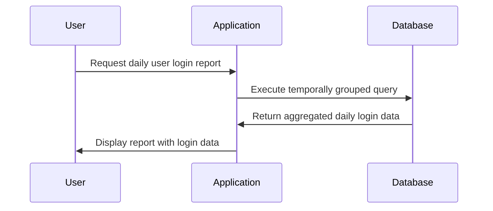

## Introduction

The Temporally Grouped Query pattern is an essential design pattern for applications that require temporal data analysis. By organizing data based on time intervals like hours, days, or months, it allows businesses and systems to perform insightful aggregations—such as determining trends, peak times, or time-based usage patterns. This pattern is particularly valuable in scenarios involving analytics for activity logs, financial transactions, or sensor data captured over time.

## Architectural Approach

### Data Partitioning and Storage

- **Partitioning Strategy**: Design your database or data lake to efficiently partition data by time. This can mean physical partitioning in databases like PostgreSQL, or logical partitioning in cloud data warehouses using partition keys.
  
- **Time-Series Databases**: Consider using time-series databases such as Amazon Timestream or InfluxDB, which are optimized for storing and querying time-based data.

### Query Optimization

- **Indexing**: Maintain appropriate indexes on timestamp columns to enhance query performance for large datasets.
  
- **Materialized Views**: Use materialized views for pre-aggregating data at common temporal intervals to reduce query computation time.

## Best Practices

- **Use of Window Functions**: Leverage SQL window functions for operations like running totals or moving averages.
  
- **Time Zone Considerations**: Account for time zones when dealing with global datasets to ensure accuracy during temporal grouping.
  
- **Caching Results**: Cache query results when it’s feasible, especially if the same query will be reused frequently over unchanged data.

## Example Code

Here's a simple SQL query demonstrating how to count user logins per day:

```sql
SELECT 
    DATE_TRUNC('day', login_time) AS day,
    COUNT(user_id) AS login_count
FROM 
    user_logins
GROUP BY 
    DATE_TRUNC('day', login_time)
ORDER BY 
    day;
```

This example uses the `DATE_TRUNC` function to truncate timestamps to the start of each day, grouping logins by these day intervals and counting logins per group.

## Diagrams



## Related Patterns

- **Event Sourcing**: Capturing state changes as a sequence of events over time fits well with temporally grouped queries for reconstructing state at any point in time.
  
- **CQRS**: Command Query Responsibility Segregation pattern often incorporates time-based query patterns to offer complex analytics in the Query model without impacting the Write model.

## Additional Resources

- Articles on temporal data processing in Apache Kafka Streams.
- Tutorials on time-series data modeling in cloud databases such as Snowflake.
- Blogs focused on using window functions for efficient data grouping in SQL.

## Summary

The Temporally Grouped Query pattern offers a robust approach for analyzing temporal data and extracting meaningful insights from it. By partitioning data, implementing suitable indices, and utilizing time-series specific tools, organizations can ensure their temporal queries are both fast and efficient. When combined with related design patterns like event sourcing and CQRS, this pattern can significantly enhance the capability of distributed data systems to provide reliable and timely analyses.
