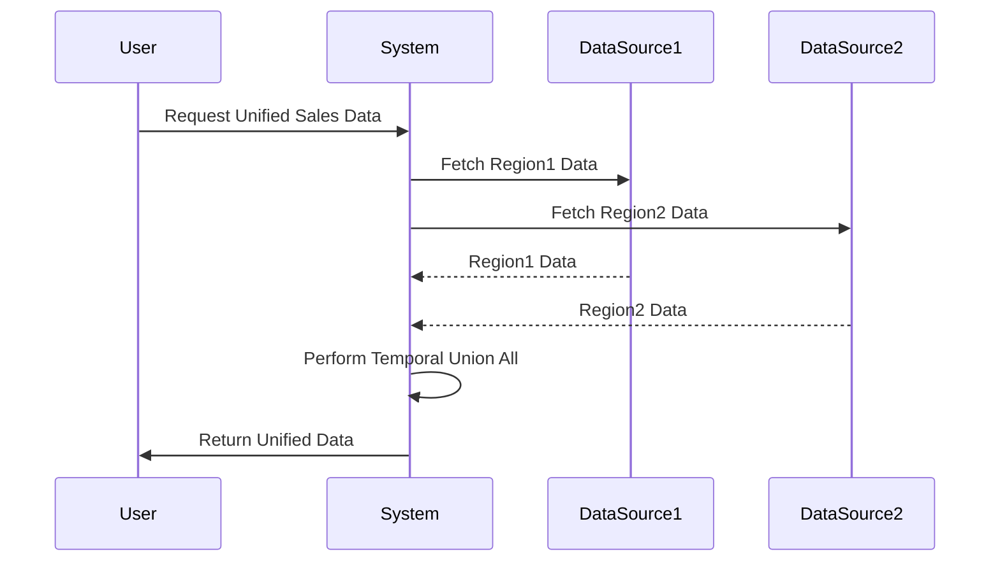

## Introduction

The **Temporal Union All** design pattern addresses the challenge of combining temporal records from multiple data sources while maintaining the integrity of each record's time period. This pattern is particularly useful in scenarios where datasets from different regions or business units need to be analyzed together in a cohesive temporal sequence.

## Context and Problem

In distributed and large-scale data environments, it's common to encounter datasets that span different time periods or originate from different sources, such as sales data from various regions. Each source may have its own time tracking and constraints, making it challenging to form a unified view that respects all individual timelines.

## Solution

The Temporal Union All pattern solves this problem by allowing for the union of temporal datasets with sequential time periods. This involves aligning data by their time-related attributes, such as:

- Transaction Start and End Dates
- Effective Dated or Validity Periods

The main steps include:

1. **Data Alignment**: Ensuring that datasets are aligned by common time-related attributes.
2. **Union Operation**: Using SQL or database-specific constructs to perform the union operation.
3. **Order Preservation**: Ensuring the time periods from individual sources are maintained in the unified dataset.

### Example Code

Below is an example SQL query demonstrating how to perform a temporal union on sales data from different regions:

```sql
SELECT * FROM (
  SELECT SalesId, ProductId, Quantity, Price, TransactionDate, 'Region1' as Source
  FROM Region1Sales
  UNION ALL
  SELECT SalesId, ProductId, Quantity, Price, TransactionDate, 'Region2' as Source
  FROM Region2Sales
)
ORDER BY TransactionDate;
```

This query unifies sales data from two regions while recording each entry's origin.

## UML Representation

Below is a simplified UML sequence diagram that illustrates the interactions involved in the Temporal Union All process:



## Related Patterns

- **Data Lake Query Pattern**: Useful for managing large volumes of unstructured and structured data while facilitating querying across combined datasets.
- **Event Sourcing**: A pattern which stores the state of a system as a sequence of events, complementing temporal data preservation.

## Additional Resources

- [Temporal Databases: Handling Time in Databases](https://example.com/temporal-databases)
- [Effective Use of SQL UNION and UNION ALL](https://example.com/sql-union)

## Summary

The Temporal Union All pattern provides a structured approach to unifying datasets that have temporal aspects, making it indispensable for data warehousing and integration environments. By preserving the integrity of time periods from different sources, organizations can perform accurate time-series analysis without compromising data quality.


