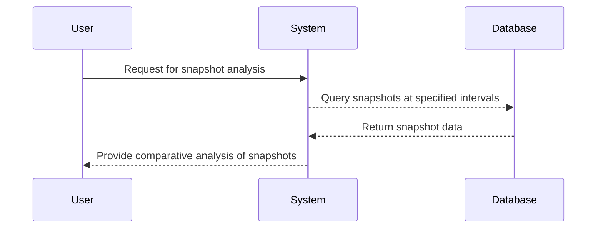

## Overview

The **Periodic Snapshot Query** design pattern is a technique used in data modeling and processing to manage, analyze, and extract meaningful insights from data captured at regular intervals. This approach is particularly useful for tracking changes over time, helping organizations understand trends, patterns, and behaviors within their datasets.

## Key Concepts

### Design Pattern Description

The Periodic Snapshot Query pattern involves capturing data at fixed intervals—for example, daily, weekly, or monthly—and storing these snapshots in a database. Analysts can then query these snapshots to detect changes, observe trends, and make data-driven decisions.

### Use Cases

- **Inventory Analysis**: By capturing periodic snapshots of inventory levels, businesses can identify trends such as increasing demand, seasonal variations, or stock shortages.
- **Financial Metrics**: Companies can track monthly or quarterly financial snapshots to gauge performance and forecast future trends.
- **Performance Metrics**: Organizations can monitor system performance and user activity by comparing snapshots taken at various times.

## Architectural Approach

### Data Storage

Data from periodic snapshots is typically stored in a time-series database or a relational database designed to support large volumes of temporal data. This data storage approach allows efficient querying and analysis of snapshots across multiple intervals.

### Querying Snapshots

Using SQL or a similar query language, analysts can compare snapshots to highlight changes. Queries might involve aggregating data over specific periods to detect patterns or running variance calculations to pinpoint significant deviations between snapshots.

## Example Code

```sql
-- SQL Query to compare inventory levels between two snapshots
SELECT 
    current_snapshot.item_id,
    current_snapshot.item_name,
    previous_snapshot.inventory_level AS previous_level,
    current_snapshot.inventory_level AS current_level,
    (current_snapshot.inventory_level - previous_snapshot.inventory_level) AS change
FROM 
    inventory_snapshots AS current_snapshot
JOIN 
    inventory_snapshots AS previous_snapshot
ON 
    current_snapshot.item_id = previous_snapshot.item_id
WHERE 
    current_snapshot.date = '2024-01-01' AND 
    previous_snapshot.date = '2023-12-01';
```

## Diagrams



## Best Practices

- **Consistent Intervals**: Ensure snapshots are taken at regular, consistent intervals to maintain data integrity and reliability.
- **Efficient Storage**: Use a dedicated time-series database or partition data by time periods to optimize performance.
- **Automation**: Automate snapshot creation and archival processes to minimize errors and maintain up-to-date datasets.

## Related Patterns

- **Slowly Changing Dimensions**: Used for tracking changes in dimensional data over time, complementary for detailed analysis.
- **Event Sourcing**: Captures all changes as a sequence of events, which can be used to reconstruct past states.

## Additional Resources

- [Time-Series Database Guide](https://example.com/time-series-db)
- [SQL for Data Analysis: Tips and Tricks](https://example.com/sql-analysis)

## Summary

The **Periodic Snapshot Query** pattern is invaluable for organizations seeking to analyze changes over specified intervals comprehensively. By leveraging periodic snapshots, businesses can transform raw data into actionable insights, better forecast trends, and optimize decision-making processes. This approach is crucial in domains requiring historical analysis, such as finance, inventory management, and performance monitoring.
