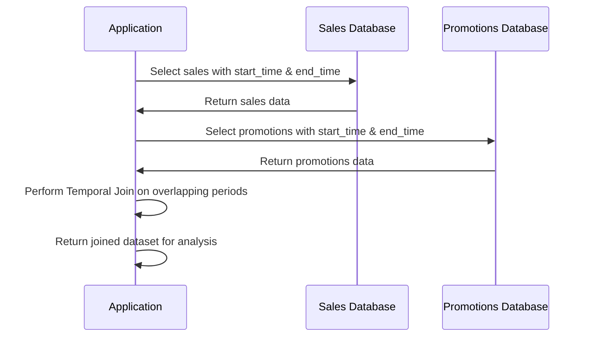

## Temporal Join

### Description

The *Temporal Join* is a data modeling design pattern used to join two temporal tables, aligning data that is valid “simultaneously” or during overlapping time periods. When dealing with temporal data—data tagged with a valid time period—it's critical to combine datasets accurately to reflect the correct alignment of facts and changes over time.

This pattern is especially useful in scenarios like auditing historical data, analyzing trends, or simulating past conditions, where accurate temporal alignment of data points can reveal valuable insights.

### Use Case Scenarios

1. **Sales and Promotions Analysis**: To determine which promotions were influencing sales at any given time, you could join sales transactions with promotions tables to see the impact when various promotions were active.

2. **Inventory and Pricing**: This pattern helps track inventory levels at specific pricing strategies over time, aiding in better demand forecasting and price-setting strategies. 

3. **Employee Role Tracking**: Useful in HR systems to determine employee responsibility and role changes overlapping with specific project timelines.

### Architectural Approaches

The implementation of temporal joins can be achieved through several approaches:

1. **SQL-Based Approach**:
   - SQL offers native support in some databases through the use of temporal tables and joins. The `OVERLAPS` or a combination of `INNER JOIN` with `BETWEEN` clauses can be used to relate time periods in SQL queries.

   ```sql
   SELECT 
     s.sale_id, 
     p.promotion_id 
   FROM 
     sales s 
   JOIN 
     promotions p 
   ON 
     s.sale_start_time <= p.promotion_end_time 
   AND 
     s.sale_end_time >= p.promotion_start_time;
   ```

2. **ETL Process**:
   - Using ETL (Extract, Transform, Load) batch processes, temporal joins can be managed outside of a production SQL context, ensuring the business logic for valid time periods is calculated during data preparation stages.

3. **Data Warehousing Solutions**:
   - Platforms like Snowflake, BigQuery, or Amazon Redshift support temporal functions and types directly, often with optimizations for handling large datasets.

### Best Practices

- **Index Temporal Fields**: To ensure performance efficiency, index the temporal start and end dates to significantly speed up the join operations.

- **Data Validation**: Clearly define and enforce the business logic rules surrounding valid time periods at both the application and database levels.

- **Use of Immute Schema**: Handling immutable time data can reduce complexity and ensure consistency in your temporal data model.

- **Avoid Overlaps**: Try to prevent overlapping time periods within individual tables unless specifically intended for overlapping joins.

### Example Code

```sql
CREATE TABLE sales (
  sale_id INT PRIMARY KEY,
  sale_start_time TIMESTAMP,
  sale_end_time TIMESTAMP,
  amount DECIMAL
);

CREATE TABLE promotions (
  promotion_id INT PRIMARY KEY,
  promotion_start_time TIMESTAMP,
  promotion_end_time TIMESTAMP,
  discount_rate DECIMAL
);

SELECT 
  s.sale_id, 
  s.amount, 
  p.promotion_id, 
  p.discount_rate 
FROM 
  sales s 
JOIN 
  promotions p 
ON 
  (s.sale_start_time BETWEEN p.promotion_start_time AND p.promotion_end_time)
OR 
  (s.sale_end_time BETWEEN p.promotion_start_time AND p.promotion_end_time)
OR
  (p.promotion_start_time BETWEEN s.sale_start_time AND s.sale_end_time)
OR
  (p.promotion_end_time BETWEEN s.sale_start_time AND s.sale_end_time);
```

### Diagram

Below is a simple UML Sequence Diagram illustrating a Temporal Join Process.



### Related Patterns

- **SCD (Slowly Changing Dimensions)**: Deals with keeping historical track of changes in dimensional data.
- **Bitemporal Data**: Involves maintaining two time periods for data validity and processing history.

### Additional Resources

- *Temporal Data & the Relational Model* by C.J. Date
- *Time Series Databases: New Ways to Store and Access Data* by Ted Dunning & Ellen Friedman
- Official PostgreSQL Documentation on [Temporal Data Types](https://www.postgresql.org/docs/current/static/builtin-taypes.html#DATETIMESTAMPCOMPLEX-TYPES)

### Summary

The Temporal Join pattern simplifies the process of analyzing time-bound datasets by providing meaningful ways to align and integrate data based on their valid timeframes, crucial for deriving insights in numerous business and analytical scenarios. Proper implementation ensures efficient querying and unearths historical and predictive insights that add value to strategic decision-making.
