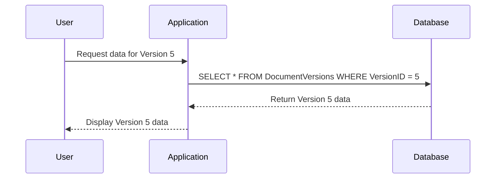

## Introduction
The Version-Specific Query design pattern is critical in systems requiring robust version control, enabling retrieval of data as it existed at any given version or revision. It is particularly relevant in contexts such as document editing systems, software configuration management, or any application that needs to maintain an historical audit trail. This pattern ensures that users or systems can query the precise state of the data at any past version.

## Architectural Approaches

### 1. **Versioned Entities**
Store each entity with a version identifier. Database tables or documents include version numbers or timestamps.

- **Pros**: Simple design, effective for immutable types.
- **Cons**: Could lead to data duplication and increased storage costs.

### 2. **Event Sourcing**
Record each change as an event, reconstructing past states by replaying events up to a specific point.

- **Pros**: Excellent audit trails, no data loss.
- **Cons**: Complex to implement, higher computational overhead.

### 3. **Temporal Tables**
Utilize database features like SQL's system-versioned temporal tables to manage time-specific data automatically.

- **Pros**: Leverages DBMS capabilities, simplifies implementation.
- **Cons**: DBMS dependent, may not be supported by all databases.

## Best Practices
- **Data Model Design**: Ensure a well-structured schema that includes version management fields such as version number, timestamp, or change notes.
- **Indexing**: Optimize query performance by indexing version fields appropriately.
- **Normalization**: Balance normalization and denormalization to optimize storage and access efficiency.
- **Access Control**: Implement strict access controls to manage who can revise versions and who can query them.

## Example Code

### SQL with Temporal Tables

```sql
CREATE TABLE DocumentVersions (
  DocumentID INT,
  Content TEXT,
  VersionID INT GENERATED ALWAYS AS IDENTITY,
  ValidFrom TIMESTAMP DEFAULT CURRENT_TIMESTAMP,
  ValidTo TIMESTAMP DEFAULT '9999-12-31',
  PERIOD FOR SYSTEM_TIME (ValidFrom, ValidTo),
  PRIMARY KEY (DocumentID, VersionID)
) WITH SYSTEM VERSIONING;
```

### Java Entity with Version Annotation

```java
@Entity
public class DocumentVersion {
  @Id
  @GeneratedValue(strategy = GenerationType.IDENTITY)
  private Long versionId;
  
  private String content;

  @Version
  private Integer version;

  // Getters and Setters
}
```

## Diagrams

### UML Sequence for Querying a Specific Version



## Related Patterns

- **Audit Log Pattern**: Maintains an immutable log of changes.
- **Snapshot Pattern**: Captures state at a point in time for performance needs.
- **Event Sourcing Pattern**: Manages state transitions through recorded events.

## Additional Resources

- **Martin Fowler's Event Sourcing**: Explore deeper into event sourcing [link](https://martinfowler.com/eaaDev/EventSourcing.html).
- **SQL Temporal Tables** Guide: Learn how to implement temporal tables in PostgreSQL, SQL Server [link](https://docs.microsoft.com/).

## Summary
The Version-Specific Query pattern is indispensable for maintaining consistent, traceable, and revisable data across various domains. Implementing this pattern in data management designs can significantly enhance the reliability and auditablility of data-centric systems. Choosing the right approach depends on specific requirements related to performance, storage, and complexity.

By embedding these practices into your architecture, you can ensure flexible, robust systems capable of supporting historical data queries while maintaining forward-thinking, version-aware applications.
