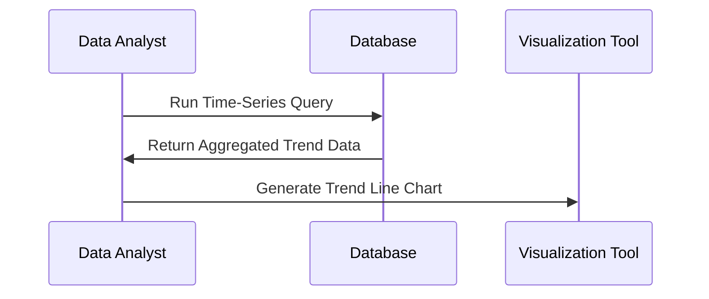

## Introduction

Temporal Trend Analysis is a cloud computing pattern used to identify patterns or changes within data over distinct time periods. This method is crucial for drawing meaningful insights from temporal data, revealing trends such as growth, decline, cyclical patterns, and seasonality.

## Key Concepts

- **Temporal Data**: Data associated with timestamps or time intervals.
- **Trends**: Directions in data, revealed over time, indicating growth, stability, or decline.
- **Period Comparison**: Identifying changes by comparing different time frames.

## Architectural Approach

Temporal Trend Analysis generally involves:

1. **Data Collection**: Gather data with time-based attributes, often leveraging time series databases like InfluxDB or Apache Druid for efficient storage and query performance.
2. **Transformation**: Standardizing and aggregating data across time intervals using ETL (Extract, Transform, Load) processes or tools like Apache NiFi.
3. **Analysis**: Querying and analyzing temporal data sets using SQL-like time-series queries.
4. **Visualization**: Displaying trends using visualization tools such as Tableau, Grafana, or Power BI for better comprehension.

### Example Scenario

Consider the context of website traffic analysis. A trend analysis can show if website visits increased in Q2 compared to Q1, help determine effective marketing campaigns, or point out seasonal variations.

### Example Code

Here's an example of how SQL can be used to extract monthly trends from a dataset:

```sql
SELECT 
  DATE_TRUNC('month', time_column) AS month,
  COUNT(visitor_id) AS visitor_count
FROM 
  website_traffic
GROUP BY 
  DATE_TRUNC('month', time_column)
ORDER BY 
  month;
```

### Visualization with Mermaid



## Best Practices

1. **Time Normalization**: Ensure consistent time zone and daylight savings handling.
2. **Granularity Selection**: Choose the right level of granularity (e.g., hourly, daily, monthly) based on the analysis requirements.
3. **Outlier Treatment**: Identify and manage outliers as they may skew trend analysis.
4. **Data Quality**: Validate the time intervals for completeness to ensure accuracy.

## Related Patterns

- **Time Window Pattern**: Used for generating metrics over a fixed rolling window of time.
- **Audit Trail Pattern**: Retains historical changes in data for compliance and deep analysis.

## Additional Resources

- [Time Series Data](https://en.wikipedia.org/wiki/Time_series)
- [Grafana for Visualization](https://grafana.com/)
- [Patterns for Scalable Temporal Data (YouTube Talk)](https://youtube.com)

## Summary

Temporal Trend Analysis is vital for understanding how specific metrics evolve. It is instrumental in areas like business analytics, marketing, and operational monitoring. By implementing this pattern, organizations can better predict future behavior, identify opportunities for growth, and address potential issues proactively.
