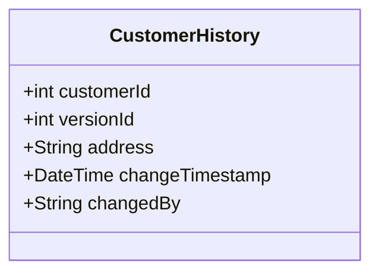
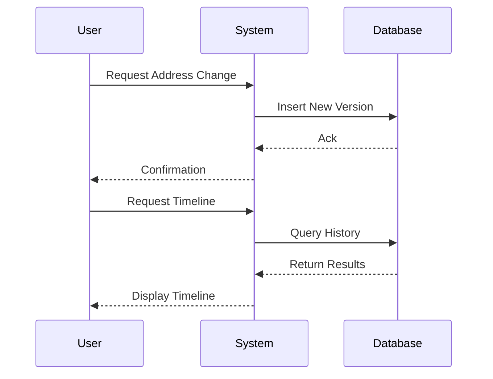

---

linkTitle: "Timeline Query"
title: "Timeline Query"
category: "Time Travel Queries"
series: "Data Modeling Design Patterns"
description: "Generates a timeline of changes for an entity, showing how its data evolved over time."
categories:
- Time Travel Queries
- Data Modeling
- Design Patterns
tags:
- data versioning
- historical queries
- time-based data
- auditing
- event sourcing
date: 2024-07-07
type: docs

canonical: "https://softwarepatternslexicon.com/103/5/4"
license: "© 2024 Tokenizer Inc. CC BY-NC-SA 4.0"
---

## Timeline Query

### Introduction

In modern data systems, the ability to trace changes to an entity over time is invaluable. This capability allows analysts and developers to understand how an entity's data has evolved, providing insights into user behavior, facilitating auditing, and enabling predictive analytics. The Timeline Query is a design pattern that facilitates querying an entity's changes chronologically.

### Problem Statement

Large-scale applications often require maintaining the history of modifications to certain entities. These edits might include user profile updates, address changes, or transactional data adjustments. The challenge is to design and implement a robust mechanism that enables efficient versioning and retrieval of historical data, while also allowing queries that construct a chronological timeline of changes.

### Solution

The Timeline Query pattern provides a structured approach to versioning data models and querying those versions in a chronological order. The pattern is designed with considerations for data management practices such as immutability, auditability, and efficient querying.

### Architectural Approach

1. **Data Storage Model**:
   - Implement a versioned data storage mechanism where each record change creates a new version. This can be implemented using techniques like Append-Only Storage or Temporal Tables.
   - Each version should include metadata like timestamps, user IDs (who made the change), and a unique version identifier.

2. **Version Management**:
   - Implement version control logic to insert new versions and update version metadata.
   - Ensure that the storage layer can efficiently handle inserts and queries for versioned data.

3. **Query Engine**:
   - Develop query interfaces that can extract the timeline of an entity. These interfaces should support filtering by time ranges, user ID, or specific changes.
   - Optimize query performance with indexing strategies based on timestamps or primary keys.

### Example Code

Below is an example using a SQL-based approach with Temporal Tables:

```sql
CREATE TABLE customer_history (
    customer_id INT,
    version_id INT,
    address VARCHAR(255),
    change_timestamp TIMESTAMP,
    changed_by VARCHAR(255),
    PRIMARY KEY (customer_id, version_id)
);

-- Insert new version
INSERT INTO customer_history (customer_id, version_id, address, change_timestamp, changed_by)
VALUES (1, 1, '123 Elm Street', now(), 'admin');

-- Query timeline for a customer
SELECT address, change_timestamp, changed_by
FROM customer_history
WHERE customer_id = 1
ORDER BY change_timestamp;
```

### Diagrams

#### UML Class Diagram



#### Sequence Diagram



### Related Patterns

- **Event Sourcing**: A pattern where changes to an application's state are stored as a sequence of events.
- **CQRS (Command Query Responsibility Segregation)**: Segregates command (write) and query (read) operations, often using different storage models.

### Best Practices

- **Use Immutable Structures**: Each change should append a new record rather than modifying existing data to preserve historical integrity.
- **Efficient Indexing and Querying**: Ensure proper indexing (e.g., on `timestamp`) for efficient retrieval of historical data in sequence.
- **Audit and Compliance**: Include user identification and reason for change metadata to support audit logging and compliance requirements.

### Additional Resources

- **"Designing Data-Intensive Applications" by Martin Kleppmann**: In-depth coverage of systems that use events and log-structured data.
- **Temporal Database Concepts**: Learn how relational databases handle time and versioned records.

### Summary

The Timeline Query pattern provides a robust mechanism for handling data versioning in applications where historical change tracking is crucial. By adopting the Timeline Query design pattern, systems can achieve better auditability, support complex analytical queries, and maintain data integrity across versions. This pattern, when combined with event sourcing or CQRS, further strengthens the overall architecture of systems dealing with complex domain data models.

---
