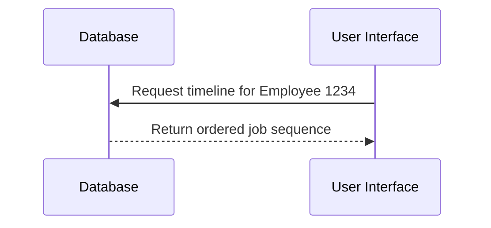

## Description

The Effective Sequence Query design pattern is used to retrieve and analyze data based on the sequence of effective dates. It is particularly useful in scenarios where understanding the chronological progression of changes is critical, such as tracking the history of an employee's job titles, rental periods, or version changes in a configuration. This pattern leverages temporal data to provide insights into how entities evolve over time, enabling better decision-making through historical analysis.

## Architectural Approaches

In implementing effective sequence queries, it is essential to maintain a well-structured database schema that supports temporal data. Each record must have attributes indicating its effective start and end dates. In SQL-based databases, common approaches include:

- **Temporal Tables**: These tables explicitly store historical data by using columns to define the period of validity (e.g., `ValidFrom` and `ValidTo`).
- **Versioning**: Maintaining multiple records with distinct version identifiers, allowing for sequence navigation.

NoSQL databases might leverage document-based structures or graphs to represent temporal changes due to their flexibility in handling semi-structured data.

## Best Practices

- **Indexing on Temporal Columns**: Ensure effective indexing on date columns (`ValidFrom`, `ValidTo`) to optimize query performance.
- **Data Archiving**: Implement strategies to archive outdated records if the dataset grows too large, preserving system performance.
- **Data Integrity**: Constraints or validation logic can be employed to ensure non-overlapping and correct sequence ordering of dates within the table.

## Example Code

Below is a simple example using SQL to query the sequence of job titles that an employee has held, in order:

```sql
SELECT job_title, valid_from, valid_to
FROM employee_job_history
WHERE employee_id = 1234
ORDER BY valid_from ASC;
```

This query returns the job titles in the order of their effective start dates, which helps in tracking the employee's career progression.

## Diagrams

Here's a Mermaid sequence diagram to illustrate how data might be effectively queried:



## Related Patterns

- **Slowly Changing Dimensions (SCD)**: Useful for handling changes in dimension tables typically used in data warehousing.
- **Event Sourcing**: Captures all changes to an application state as a sequence of events, enabling time-travel queries akin to effective sequence queries.

## Additional Resources

- [Temporal Tables in SQL Server Documentation](https://docs.microsoft.com/en-us/sql/relational-databases/tables/temporal-tables)
- [Time-Oriented Data Analysis in Data Warehousing](https://www.somejournal.com/temporal-data-analysis)

## Summary

The Effective Sequence Query pattern provides a structured way to query and analyze data based on its chronological sequence. By effectively leveraging temporal data, this pattern enables a deep understanding of change progression over time, which is invaluable in fields like Human Resources, Historical Data Analysis, and many more. Maintaining temporal tables and applying the best practices shared in this pattern will greatly enhance your ability to conduct robust temporal queries.
