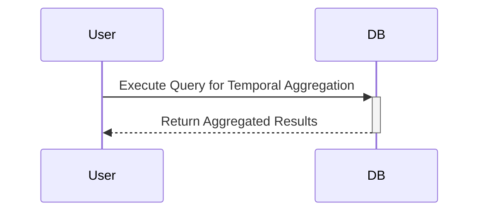

## Introduction

Temporal Aggregation refers to the process of summarizing data over specified time intervals. It plays a critical role in analyzing trends, patterns, and behaviors over time, making it indispensable in fields like financial analytics, sales tracking, and performance monitoring.

## Design Pattern Explanation

The Temporal Aggregation design pattern focuses on leveraging data across distinct temporal dimensions such as days, weeks, months, or quarters. This pattern is aligned with time-bound queries, where aggregations help provide meaningful insights by categorizing data within defined periods.

### Key Concepts

- **Temporal Dimensions**: These are ordered and continuous intervals, such as daily, monthly, or quarterly bases, along which data can be aggregated for analysis.
- **Interval Calculation**: Involves computing values for specific intervals. For instance, calculating the sum of sales transactions per month.
- **Window Functions**: SQL and Big Data technologies provide windowing capabilities to efficiently compute over dynamic windows or frames in time.

### Architectural Approaches

- **Database-centric**: Utilize RDBMS features such as SQL window functions or built-in temporal data types to perform aggregations.
- **ETL Pipelines**: Use Extract, Transform, Load (ETL) jobs in distributed data systems like Apache Spark or Flink to perform and schedule temporal aggregations.
- **Real-Time Processing**: Implement real-time aggregation using Apache Kafka Streams or similar technologies to process data as it flows in.

## Example Code

For demonstration, let's calculate the total sales per quarter over the past five years using SQL:

```sql
SELECT 
    EXTRACT(YEAR FROM sales_date) AS year,
    EXTRACT(QUARTER FROM sales_date) AS quarter,
    SUM(sale_amount) AS total_sales
FROM 
    sales
WHERE 
    sales_date >= DATEADD(YEAR, -5, CURRENT_DATE)
GROUP BY 
    EXTRACT(YEAR FROM sales_date), EXTRACT(QUARTER FROM sales_date)
ORDER BY 
    year, quarter;
```

### Explanation

- **EXTRACT**: Used to extract the year and quarter from sales_date.
- **SUM**: Aggregates sale_amount grouped per quarter and year.
- **DATEADD**: Filters sales within the last five years.

## Diagrams

### Mermaid UML Sequence Diagram



## Related Patterns

- **Event Sourcing**: Event sourcing can complement Temporal Aggregation by providing a log of all changes, enabling the reconstruction of past states.
- **CQRS (Command Query Responsibility Segregation)**: Separates the read side to facilitate performant temporal queries while maintaining complex command processing.
- **Time-Series Databases**: Specialized databases like InfluxDB or TimescaleDB offer native support for temporal queries and aggregations.

## Additional Resources

- **[Temporal Data in SQL](https://www.sqlservertutorial.net/sql-server-basics/sql-server-date-functions/)**: Understanding how SQL handles temporal data types and functions.
- **[Kafka Streams](https://kafka.apache.org/documentation/streams/)**: Implementing real-time temporal data processing using Kafka Streams API.
- **[Apache Flink Documentation](https://flink.apache.org/)**: Event processing and aggregation using Apache Flink for large-scale data streams.

## Summary

Temporal Aggregation provides an effective method to analyze data across time-based intervals, uncovering patterns and facilitating data-driven decisions. By embracing this pattern, organizations can better understand temporal trends and enhance decision-making processes by utilizing RDBMS features, ETL pipelines, and real-time data processing tools.
