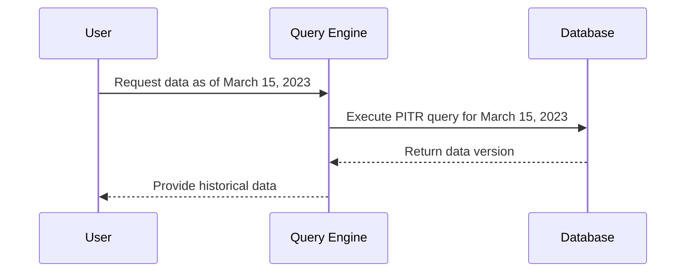

## Introduction

Point-in-Time Recovery (PITR) is a powerful technique in the realm of data modeling, enabling the restoration of a dataset to its state at a specific moment in time. This approach is invaluable for scenarios involving data correction, system auditing, and rollback actions following unintended changes or data corruption events. By leveraging historical data, organizations can align their data management practices with business continuity and compliance requirements.

## Detailed Explanation

### Core Concept

The core idea behind a Point-in-Time Recovery Query is to maintain a versioned history of your data changes, allowing you to retrieve or revert the data to any previous state. This often involves:

- Capturing every change to the dataset with timestamps.
- Using special timestamped tables or change data capture mechanisms.
- Querying versions of the data as it appeared at a specific moment.

### Architectural Approaches

1. **Temporal Tables**: Utilize temporal tables which store the historical versions of your records alongside their valid time ranges.
   
2. **Change Data Capture (CDC)**: Implement CDC to continuously monitor and record all changes at a granular level, typically using logs or an external system.

3. **Event Sourcing**: Store sequences of changes (events) to apply any past state of the application rather than overwriting the current dataset.

### Example Code

Here's a simple representation using SQL temporal tables for PITR:

```sql
CREATE TABLE InventoryHistory (
    id INT,
    product_name VARCHAR(255),
    quantity INT,
    valid_from TIMESTAMP,
    valid_to TIMESTAMP
);

-- Insert record into InventoryHistory upon changes
-- Here is how you can query data as it existed at a specific point:

SELECT product_name, quantity
FROM InventoryHistory
WHERE
   '2023-03-15 08:00:00' BETWEEN valid_from AND valid_to;
```

### Diagrams

Here's a simplified example of a sequence diagram illustrating Point-in-Time Recovery:



### Best Practices

- Ensure meticulous management of version records to avoid performance bottlenecks as data history grows.
- Periodically archive historical data to balance performance with long-term retention needs.
- Implement security measures to limit the access and mutation of historical data.

## Related Patterns

- **Event Sourcing**: In contrast to PITR, this method applies a series of events to derive the current state.
- **Data Versioning**: Maintains and manages multiple versions of a dataset over time.
- **Snapshotting**: Combines with PITR to take periodic full data snapshots for quick state recreation.

## Additional Resources

1. [Temporal Tables in SQL Server](https://docs.microsoft.com/en-us/sql/relational-databases/tables/temporal-tables?view=sql-server-ver15) - Microsoft Documentation.
2. [Event Sourcing Pattern](https://martinfowler.com/eaaDev/EventSourcing.html) - Martin Fowler
3. [Change Data Capture (CDC)](https://www.ibm.com/docs/en/i/7.2?topic=capabilities-change-data-capture) - IBM Documentation

## Summary

Point-in-Time Recovery Query design pattern is a strategic approach designed to restore historical data states accurately and efficiently. By understanding and applying this pattern, organizations can ensure robust data integrity and compliance, meet audit requirements, and efficiently recover from data anomalies. Whether through temporal tables, event sourcing, or change data capture strategies, this pattern is a foundational element in modern data management.

--- 

This structured exploration into the Point-in-Time Recovery Query pattern provides insights into implementing effective data recovery strategies, enhancing data resilience, and supporting policy compliance across diverse data platforms.
