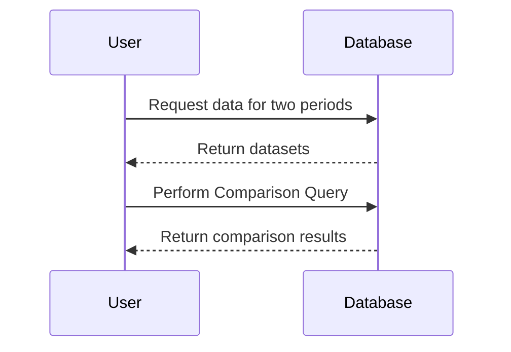

## Introduction

Period Comparison Query is a design pattern often utilized in data analytics to provide insights into how data evolves over time. By comparing datasets from two distinct time periods, businesses can uncover trends, changes, and anomalies that inform decision-making processes—from marketing strategies to operational improvements.

These queries are crucial in sectors like retail, finance, and healthcare, where understanding temporal dynamics is critical for competitive advantage and operational efficiency.

## Detailed Explanation

The Period Comparison Query pattern involves querying a database to extract data from two different time periods and then comparing these datasets to identify variations or trends. The primary components of this pattern are:

1. **Data Extraction**: Retrieve datasets for the specified periods.
2. **Data Comparison**: Perform operations to compare attributes across the two datasets.
3. **Trend Analysis**: Analyze the results to identify meaningful patterns, anomalies, or changes.

The key is to have time-dimensional data that supports such analysis, equipped with appropriate attribute metadata that allows for precise querying and filtering.

## Architectural Approaches

### Data Warehousing

One common implementation of the Period Comparison Query is within a data warehouse architecture. Typically, data is stored with a temporal attribute that allows slicing across time periods. Using SQL, you can extract and compare datasets across specified periods.

#### ETL Processes

Ensure your ETL (Extract, Transform, Load) processes accurately timestamp data entries. This temporal dimension becomes critical for your period-based querying capabilities. 

### Data Lakes

With the advent of big data architectures, period comparisons can be implemented using data lakes, which allow for flexible schema-on-read strategies. This is particularly useful when dealing with semi-structured or unstructured data. 

## Best Practices

- **Ensure Time Dimension Accuracy**: Data should have a reliable and accurate timestamp for valid comparisons.
- **Optimize Query Performance**: Utilize indexes effectively to speed up comparison queries.
- **Data Consistency**: Validate data consistency between the two periods being compared.
- **Aggregation**: Consider pre-aggregating data, if feasible, to enhance performance during period comparison.
  
## Example Code

Below is an example of how you might perform a period comparison using SQL:

```sql
SELECT 
    a.product_id, 
    SUM(a.sales) AS sales_period_1, 
    SUM(b.sales) AS sales_period_2,
    (SUM(b.sales) - SUM(a.sales)) AS sales_difference
FROM 
    sales as a
JOIN 
    sales as b ON a.product_id = b.product_id
WHERE 
    a.timestamp BETWEEN '2022-12-01' AND '2022-12-31'
    AND b.timestamp BETWEEN '2023-12-01' AND '2023-12-31'
GROUP BY 
    a.product_id;
```

This query compares sales figures for the same product during December of 2022 and 2023.

## Diagrams

Below is a simplified representation of how a period comparison might be modeled:



## Related Patterns

- **Slowly Changing Dimensions (SCD)**: Deals with managing historical data and enables efficient period comparison.
- **Temporal Tables**: Tables that maintain data changes over time, providing an inherent mechanism for period comparisons.

## Additional Resources

- [Temporal Data & Time Series Analysis](https://en.wikipedia.org/wiki/Time_series)
- [SQL Window Functions](https://www.postgresql.org/docs/current/tutorial-window.html)
- [Data Warehousing Concepts](https://www.oracle.com/database/technologies/datawarehouse-bigdata/what-is-a-data-warehouse.html)

## Summary

The Period Comparison Query pattern is essential for deriving insights from temporal data. By leveraging appropriate architectural models and following best practices, organizations can effectively utilize this pattern to make informed business decisions. Whether within data warehouses or lakes, this pattern is invaluable for businesses looking to harness the full power of their historical and current data assets.
