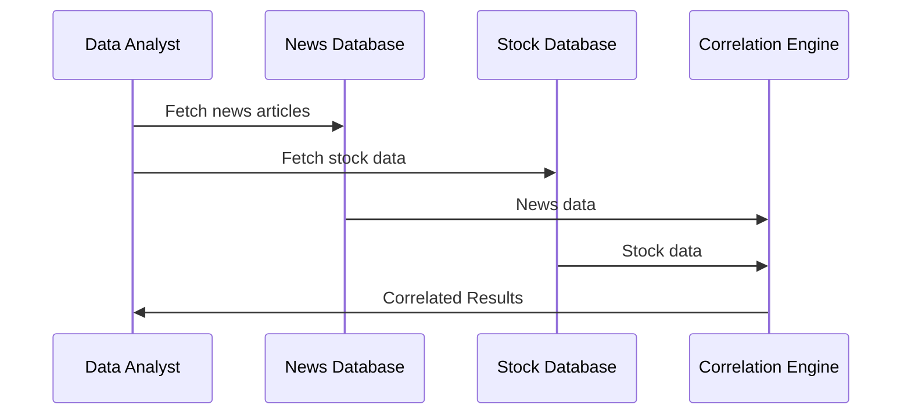

---

linkTitle: "Temporal Correlation Query"
title: "Temporal Correlation Query"
category: "Time Travel Queries"
series: "Data Modeling Design Patterns"
description: "Temporal Correlation Query is a design pattern that focuses on identifying relationships between data changes over time, specifically correlating events in one dataset with those in another over the same timeframe."
categories:
- Data Modeling
- Time Travel Queries
- Data Analysis
tags:
- Temporal Data
- Correlation
- Data Analytics
- Event Sourcing
- Pattern Matching
date: 2024-07-07
type: docs
canonical: "https://softwarepatternslexicon.com/103/5/9"
license: "© 2024 Tokenizer Inc. CC BY-NC-SA 4.0"
---

## Overview

The **Temporal Correlation Query** design pattern allows for the discovery of relationships and patterns between changes in datasets over time. By correlating events from different sources, this pattern aids in understanding the causality or association of simultaneous or sequential data changes across datasets. This is particularly prevalent in domains like finance, where the fluctuation in stock prices can be attributed to, or correlated with, external news events or economic indicators.

## Detailed Explanation

This pattern is essential in scenarios where changes in datasets may correspond to external or internal events. It provides the methodology to track and correlate these changes effectively, by leveraging temporal dimensions in the data.

### Architectural Considerations

1. **Data Sourcing**: 
   - Use event sourcing or change data capture techniques to feed data changes into a pipeline where they can be processed for correlation.

2. **Time Alignment**:
   - Ensure datasets utilize a robust timestamp format, often leveraging UTC, and are aligned with a common temporal granularity (e.g., millisecond, second).

3. **Data Processing**:
   - Utilize distributed computing systems like Apache Flink or Apache Kafka Streams to handle real-time stream processing, aiding in correlating vast datasets efficiently.

4. **Correlation Analysis**: 
   - Implement statistical methods (e.g., Pearson or Spearman correlation coefficients) alongside machine learning techniques to detect and quantify correlations.

## Example Scenario

Imagine a scenario where you're tasked to identify how certain news events impact the trading volume of technology stocks. The approach is twofold:

1. Collect real-time news article feeds and stock trading data.
2. Align timestamps from both datasets and use a sliding window analysis in a streaming processing tool to correlate spikes in trading volume with the timing of news releases.

**Sample Code Snippet Using Apache Flink - Pseudo Code**:
```scala
val newsStream: DataStream[NewsEvent] = ...
val stockStream: DataStream[StockEvent] = ...

val correlatedStream = newsStream
  .keyBy(_.topic) // Group by news topic
  .connect(stockStream.keyBy(_.ticker)) // Connect to stock stream by ticker
  .process(new CoProcessFunction[NewsEvent, StockEvent, CorrelatedEvent] {
    override def processElement1(news: NewsEvent, ctx: Context, out: Collector[CorrelatedEvent]): Unit = {
      // Process news event
    }
    override def processElement2(stock: StockEvent, ctx: Context, out: Collector[CorrelatedEvent]): Unit = {
      // Process stock event and correlate
    }
  })
```

## Diagram



## Related Patterns and Concepts

- **Event Sourcing**: Captures every change to data as a sequence of events.
- **Snapshot Artifact Pattern**: Efficiently stores the state of an entity at specific points for faster correlation.
- **Batch Processing Pattern**: Complements real-time stream processing by validating correlations over larger historical datasets.

## Additional Resources

- [Apache Flink Documentation](https://flink.apache.org/documentation.html)
- [Correlation Coefficients in Machine Learning](https://towardsdatascience.com/correlation-coefficients-and-how-they-matter-in-machine-learning-a2b2b0751762)
- [Change Data Capture (CDC) Techniques](https://www.cloudkarafka.com/blog/change-data-capture-debezium.html)

## Summary

The Temporal Correlation Query pattern is a powerful tool for data analysts and engineers aiming to extract meaningful insights from time-variant data. By structuring queries that leverage time and causality effectively, you can derive actionable business intelligence across various domains. This pattern incorporates real-time processing capabilities, ensuring up-to-date correlations for decision-making.
