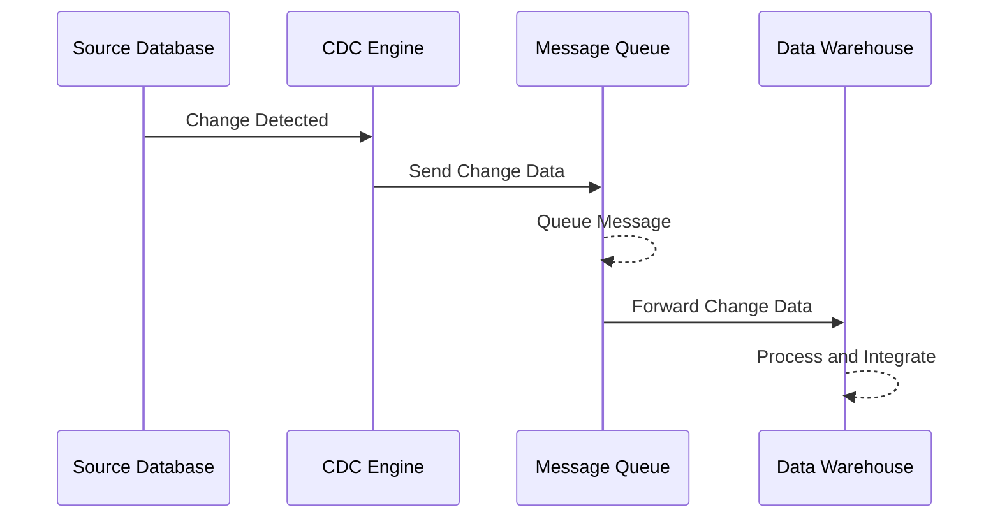

## Overview of Change Data Capture (CDC)

Change Data Capture (CDC) is a sophisticated data integration and tracking pattern that facilitates the capturing and logging of database changes, specifically inserts, updates, and deletes. By leveraging this pattern, organizations can enhance data accuracy, consistency, and compliance, particularly in auditing, reporting, and data analysis tasks.

## Purpose

The primary goal of CDC is to ensure that any changes made to the source data are accurately and promptly reflected across systems that depend on this data. CDC minimizes redundancy and ensures data integrity, making it a crucial component of data warehousing, ETL (extract, transform, load) processes, and real-time analytics.

## Design Approach

1. **Change Detection**: Identify changes in the data source by examining transaction logs, database triggers, or timestamp columns.
2. **Capture Mechanism**: Use methods like polling (scheduled interval collection) or event-driven logging (real-time change recording).
3. **Data Storage**: Store changes in a dedicated format and location, often involving a change table, message queue, or an intermediate data store.
4. **Applying Changes**: Deliver captured data to consuming applications through integration processes like ETL, message brokering, or real-time pipelines.

## Example Implementation

Imagine implementing CDC for a customer database in a retail organization:

- **Database Triggers** can be set to capture and log any changes to customer details in an audit table.
- **Message Queues**, such as Apache Kafka, can forward these changes for integration into data lakes or analytical databases.
  
Here's a basic implementation example using Java with Debezium for capturing PostgreSQL database changes:

```java
import io.debezium.config.Configuration;
import io.debezium.embedded.Connect;
import io.debezium.embedded.EmbeddedEngine;
import java.nio.file.Path;
import java.util.Properties;

public class CDCExample {
    public static void main(String[] args) {
        Properties props = new Properties();
        props.setProperty("name", "cdc-engine");
        props.setProperty("connector.class", "io.debezium.connector.postgresql.PostgresConnector");
        props.setProperty("plugin.name", "pgoutput");
        props.setProperty("database.hostname", "localhost");
        props.setProperty("database.port", "5432");
        props.setProperty("database.user", "user");
        props.setProperty("database.password", "password");
        props.setProperty("database.dbname", "customers");
        props.setProperty("table.include.list", "public.customers");

        Configuration config = Configuration.from(props);
        EmbeddedEngine engine = EmbeddedEngine.create().using(config).notifying(System.out::println).build();

        Executors.newSingleThreadExecutor().execute(engine);
    }
}
```

## Diagrams

### Sequence Diagram of CDC Workflow



## Related Patterns

- **Event Sourcing**: Similar to CDC, it focuses on capturing and preserving states but at a domain event level.
- **ETL Pipeline**: Often used along with CDC for data transformation as changes are extracted and loaded into target systems.
- **Data Streaming**: Advanced CDC implementations leverage real-time streaming platforms for immediate change propagation.

## Additional Resources

1. **Debezium Documentation**: [Debezium](https://debezium.io/) for capturing changes via Kafka Connect.
2. **AWS DMS Documentation**: [AWS DMS](https://aws.amazon.com/dms/) for cloud-based CDC solutions.
3. **Confluent Platform**: [Confluent](https://www.confluent.io/) for real-time stream processing incorporated with CDC.

## Summary

Change Data Capture is a robust pattern offering a reliable mechanism to ensure data consistency and real-time insight into data changes. By implementing CDC, organizations can enhance their responsiveness to data variations, improve integration across heterogeneous systems, and comply with regulatory measures through comprehensive auditing capabilities.
