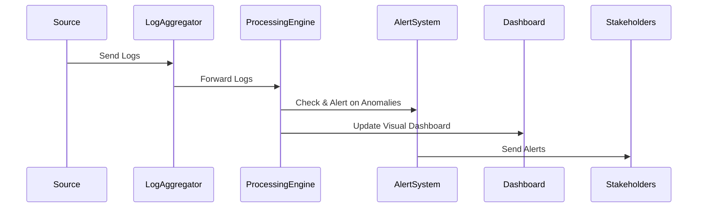

## Description

Real-Time Monitoring is a critical design pattern for ensuring the continuous monitoring of system and application logs to promptly detect and respond to events as they unfold. This approach is imperative for maintaining the security, reliability, and performance of cloud-based and distributed applications. Real-time monitoring assists organizations in identifying potential security threats, performance bottlenecks, and system failures, enabling quick mitigation and minimal downtime.

Security Information and Event Management (SIEM) systems exemplify this pattern by aggregating, analyzing, and alerting on audit logs in real-time to identify security threats and other anomalies.

## Architectural Approach

Implementing real-time monitoring involves several architectural considerations:

1. **Log Aggregation**: Centralize log data from multiple sources such as applications, databases, servers, and network devices.

2. **Data Ingestion and Processing**: Utilize systems like Apache Kafka for ingesting huge volumes of log data. Real-time processing frameworks like Apache Flink can process and analyze these logs on-the-fly.

3. **Alerting and Notification**: Real-time alerting mechanisms should be employed to notify relevant stakeholders upon the detection of significant events or anomalies.

4. **Dashboarding and Visualization**: Use tools like Grafana or Kibana for visualizing live data which assists in quick decision-making.

5. **Scalability and Availability**: Leverage cloud services (AWS Kinesis, Azure Event Hubs, or GCP Pub/Sub) for scaling and ensuring high availability.

## Best Practices

- **Implement Redundancy**: Ensure there are redundant pathways for log data to avoid single points of failure.

- **Define Clear SLAs (Service Level Agreements)**: Set and agree on acceptable thresholds for monitoring metrics with stakeholders.

- **Regular Audits and Testing**: Conduct regular security audits and testing to ensure the monitoring system's efficacy.

- **Data Retention Policies**: Implement appropriate log retention and categorization policies to deal with the massive volume of log data efficiently.

- **Anomalous Event Definition**: Work with security experts to clearly define what constitutes an anomalous event to reduce false positives.

## Example Code

```scala
// A simple Kafka producer example in Scala for sending log messages
import java.util.Properties
import org.apache.kafka.clients.producer.{KafkaProducer, ProducerRecord}

object RealTimeLogProducer {
  def main(args: Array[String]): Unit = {
    val props = new Properties()
    props.put("bootstrap.servers", "localhost:9092")
    props.put("key.serializer", "org.apache.kafka.common.serialization.StringSerializer")
    props.put("value.serializer", "org.apache.kafka.common.serialization.StringSerializer")

    val producer = new KafkaProducer[String, String](props)

    for (i <- 1 to 100) {
      val key = s"key-$i"
      val value = s"log-message-$i"
      val record = new ProducerRecord[String, String]("logs", key, value)
      producer.send(record)
    }

    producer.close()
  }
}
```

## Diagram

Here is a basic Mermaid sequence diagram illustrating real-time monitoring with log aggregation and alerting:



## Related Patterns

- **Event Sourcing**: Logs as primary data storage, capturing the state changes.
- **CQRS (Command Query Responsibility Segregation)**: This can enhance real-time monitoring by separating read and write operations for efficiency.
- **Publish-Subscribe**: Often used with monitoring systems for real-time distribution of log events.

## Additional Resources

- [Using Apache Kafka for Real-Time Monitoring](https://kafka.apache.org/documentation/)
- [Introduction to Apache Flink](https://flink.apache.org/)
- [SIEM Best Practices](https://www.sans.org/)

## Summary

Real-time monitoring transforms how organizations maintain and secure their IT infrastructure. It provides the necessary tools to swiftly react to events, enhancing overall system resilience and security. By employing patterns like log aggregation, real-time data processing, and robust alerting systems within cloud environments, organizations can safeguard against foreseeable threats and maintain smooth operational continuity.
