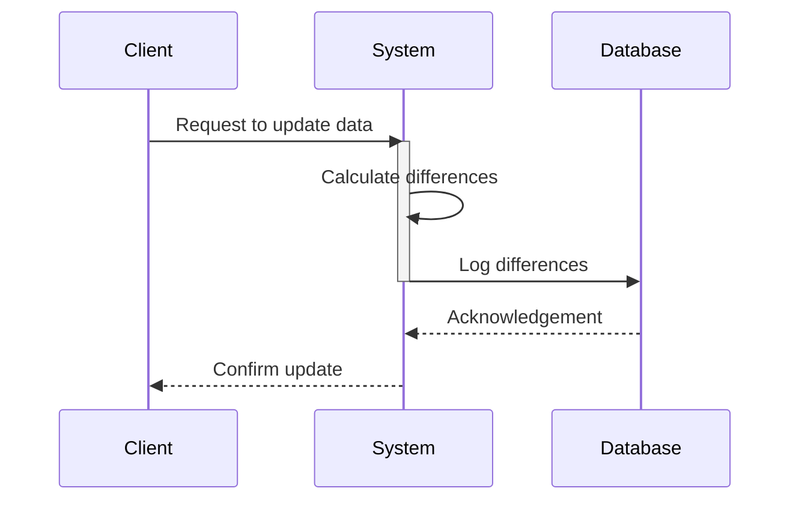

## Differential Logging

### Description

Differential Logging is a design pattern employed to efficiently track changes in data by logging only the differences between the new and old states. This pattern allows systems to capture the exact modifications in datasets while minimizing the amount of logged information, thus reducing storage and processing overhead. It is particularly beneficial in scenarios where full data logging is impractical due to size constraints or performance considerations.

### Architectural Approach

1. **Identification of Changes**: Monitor data alterations in real-time or batch processes, pinpointing what specific elements have been modified.
  
2. **Before and After Images**: Capture 'before' and 'after' snapshots of the modified data records to highlight specific changes.
  
3. **Delta Calculation**: Calculate the 'delta', the minimal set of changes that transition data from its previous state to the new state. This is fundamental to forming a cohesive log entry.
  
4. **Storage Management**: Store differential logs in a database optimized for quick retrieval and analysis, such as a NoSQL store with high read efficiency.

### Example Code

The following example in Java demonstrates logging differences using a simple object.

```java
import java.util.HashMap;
import java.util.Map;

public class DifferentialLogger {

    public Map<String, Object> logDifferences(Map<String, Object> oldState, Map<String, Object> newState) {
        Map<String, Object> diffMap = new HashMap<>();
        
        for (String key : newState.keySet()) {
            if (!oldState.containsKey(key) || !oldState.get(key).equals(newState.get(key))) {
                diffMap.put(key, newState.get(key));
            }
        }
        return diffMap;
    }
}

// Usage
Map<String, Object> oldState = Map.of("name", "John", "age", 30);
Map<String, Object> newState = Map.of("name", "John", "age", 31);

DifferentialLogger logger = new DifferentialLogger();
Map<String, Object> differences = logger.logDifferences(oldState, newState);

System.out.println(differences); // Output: {age=31}
```

### Diagrams

Here's a sequence diagram illustrating the differential logging process.



### Related Patterns

- **Event Sourcing**: Stores all state changes as a sequence of events, useful for rebuilding state.
- **Change Data Capture (CDC)**: Captures and logs all changes in database records, often used to replicate data.

### Additional Resources

- [Martin Fowler on Event Sourcing](https://martinfowler.com/eaaDev/EventSourcing.html)
- [Change Data Capture Techniques](https://www.ibm.com/docs/en/i/options?topic=cdc-introduction)

### Summary

Differential Logging optimizes logging by solely recording data changes, reducing storage demands and simplifying the audit process. It effectively complements larger systems that employ Event Sourcing or CDC for comprehensive data management.

This pattern particularly aids in environments requiring efficient data tracking without incurring the overhead of logging complete datasets. By ensuring that individual data changes are described and stored succinctly, Differential Logging provides a practical solution for audit logging in complex systems.
