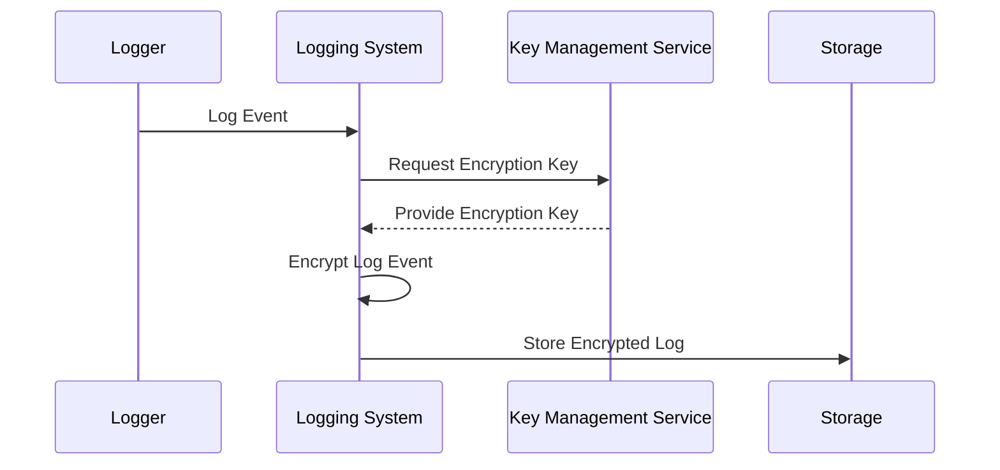

## Overview

Log Encryption is a design pattern focused on securing audit logs by encrypting their contents to ensure sensitive information remains confidential and inaccessible to unauthorized entities. This pattern is crucial in complying with regulations like GDPR, HIPAA, and other data protection laws which mandate the safeguarding of personal and sensitive information captured in logs.

## Problem Statement

Audit logs often contain detailed information about user actions, system events, and communications that may include sensitive data. If these logs are exposed to unauthorized access, it can lead to data breaches, privacy violations, and compliance failures. There is a need for a robust mechanism to protect this data throughout its lifecycle.

## Solution

The Log Encryption pattern involves the encryption of log data as soon as it is recorded. Encryption can be configured at various levels based on requirements:

1. **Symmetric Encryption**: Uses a single key for both encryption and decryption. Suitable for internal logging systems where key management is simpler.

2. **Asymmetric Encryption**: Uses a public key for encryption and a private key for decryption. Best for systems involving multiple third-party entities to ensure higher security.

3. **Hybrid Encryption**: Combines symmetric and asymmetric encryption, often using asymmetric encryption to securely exchange symmetric keys.

Implementing log encryption involves certain key steps:
- **Key Management**: Securely managing encryption keys using tools like AWS KMS, Google Cloud KMS, or HashiCorp Vault.
- **Secure Transmission**: Ensuring logs are transmitted over encrypted channels (e.g., TLS).
- **Integration with Logging Systems**: Modifying existing logging frameworks or using plugins that support encryption (e.g., Log4j, Fluentd).

## Best Practices

- **Minimum Required Logging**: Record only the necessary information in logs to minimize sensitive data exposure.
- **Access Control**: Implement strict access control mechanisms to the encrypted logs, allowing only authorized personnel to decrypt and view logs.
- **Key Rotation**: Regularly rotate encryption keys to enhance security.
- **Monitor and Audit**: Continuously monitor logging activities and audit accesses to the log management system.

## Example Code

Below is an example of integrating log encryption using Java and the Log4j framework with AWS Key Management Service (KMS) for key management:

```java
import com.amazonaws.services.kms.AWSKMS;
import com.amazonaws.services.kms.AWSKMSClientBuilder;
import com.amazonaws.services.kms.model.EncryptRequest;
import org.apache.logging.log4j.LogManager;
import org.apache.logging.log4j.Logger;

import java.nio.ByteBuffer;
import java.nio.charset.StandardCharsets;

public class EncryptedLogger {
   private static final Logger logger = LogManager.getLogger(EncryptedLogger.class);
   private static final AWSKMS kmsClient = AWSKMSClientBuilder.defaultClient();
   private static final String keyId = "alias/your-kms-key";

   public void logEncryptedMessage(String message) {
       try {
           ByteBuffer plaintext = ByteBuffer.wrap(message.getBytes(StandardCharsets.UTF_8));
           EncryptRequest req = new EncryptRequest().withKeyId(keyId).withPlaintext(plaintext);
           ByteBuffer ciphertext = kmsClient.encrypt(req).getCiphertextBlob();
           logger.info(ciphertext);
       } catch (Exception e) {
           logger.error("Encryption failed", e);
       }
   }
}
```

## Diagram



## Related Patterns

- **Access Logging Pattern**: Focuses on recording user access events in a structured format.
- **Security by Obscurity**: Utilizing obfuscation alongside encryption for additional pseudo-security.
- **Anonymization Pattern**: Ensuring that logs do not contain identifiable sensitive information.

## Additional Resources

- [Encryption in Java: A Tutorial](https://dzone.com/articles/encryption-decryption-in-java)
- [AWS Key Management Service (KMS)](https://aws.amazon.com/kms/)
- [Understanding GDPR and its Impact on Logs](https://www.gdpreu.org/the-regulation/key-concepts/pseudonymization-and-encryption/)

## Summary

The Log Encryption pattern is an essential approach to secure audit logging, ensuring sensitive information remains protected and compliant with data protection regulations. Through the use of robust encryption techniques and key management, organizations can mitigate risks of data exposure and maintain the integrity and confidentiality of their log data.
