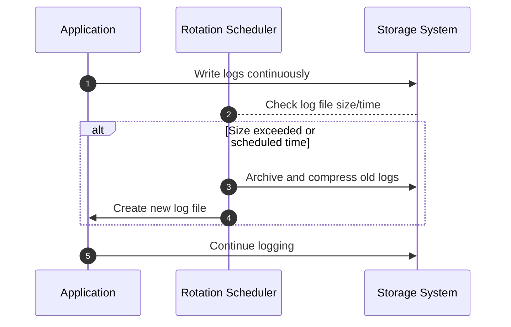

Log rotation is a crucial pattern in modern computing systems aimed at maintaining optimal storage usage and system efficiency by managing log file sizes. It involves systematically archiving older logs and generating new log files to document ongoing system activities, thereby preventing logs from consuming excessive disk space and maintaining readability for auditing or debugging purposes.

## Detailed Explanation

### Key Concepts

- **Log File Creation**: Systems generate log files to record crucial events, transactions, and system states. Over time, these files can grow significantly, consuming disk resources and becoming unwieldy for analysis.
  
- **Log Rotation Strategy**: This strategy involves creating new log files periodically (daily, weekly, monthly) or when a size threshold is reached. The old files can be archived, compressed, or deleted based on retention policies.
  
- **Archiving and Compression**: To save disk space, old logs are often compressed into formats like `.gz` or `.zip`. These logs are typically archived in a structured manner, enabling easy retrieval when needed.

## Architectural Approaches

### Scheduled Rotation

Implement scheduled tasks that trigger log rotation at defined intervals. Popular cron jobs or equivalent scheduler mechanisms can handle this in UNIX and Linux systems.

### Size-Based Rotation

Triggers log rotation based on the file size, suitable for high-traffic applications where logs grow rapidly.

### Retention Policies

Define clear strategies specifying the duration for which logs should be retained and the archiving methods, balancing between storage constraints and compliance requirements.

## Best Practices

- **Automate**: Use tools and scripts to manage rotation processes to minimize manual errors and interventions.
- **Centralize Logs**: Integrate with centralized logging systems such as Elasticsearch, Logstash, and Kibana (ELK), or cloud-based solutions to facilitate better search capabilities and analysis.
- **Monitor and Alert**: Establish alerts for failures in log rotation processes to ensure continuity and system health.
- **Security Compliance**: Ensure log files are managed in compliance with industry-specific regulations like GDPR or HIPAA, which may necessitate encryption and secure access controls.

## Example Code

### Log4j Configuration for Log Rotation

The following example illustrates a simple configuration using Apache Log4j, a widely adopted logging framework:

```xml
<Configuration status="WARN">
  <Appenders>
    <RollingFile name="RollingFileAppender" fileName="logs/app.log"
                 filePattern="logs/app-%d{MM-dd-yyyy}.log.gz">
      <PatternLayout>
        <Pattern>%d %p %c{1.} [%t] %m%n</Pattern>
      </PatternLayout>
      <Policies>
        <TimeBasedTriggeringPolicy />
        <SizeBasedTriggeringPolicy size="10 MB"/>
      </Policies>
    </RollingFile>
  </Appenders>
  <Loggers>
    <Root level="debug">
      <AppenderRef ref="RollingFileAppender"/>
    </Root>
  </Loggers>
</Configuration>
```

In this setup:
- Logs are rotated daily and also if the file exceeds 10MB.
- Old logs are compressed using GZIP.

## Diagrams

### Sequence Diagram for Log Rotation



## Related Patterns

- **Centralized Log Aggregation**: Directs logs from multiple sources to a central repository for better search and analytics.
  
- **Streaming Log Processing**: Real-time processing of log data for insights or alerting.

- **Immutable Logging**: Ensures that once a log entry is written, it cannot be modified, enhancing security and traceability.

## Additional Resources

- [Log4j Logging Framework](https://logging.apache.org/log4j/2.x/)
- [Logging Best Practices in AWS](https://aws.amazon.com/blogs/)
- [GDPR Guidance on Logging Practices](https://gdpr-info.eu)

## Final Summary

Log rotation is an essential pattern for robust logging practices, ensuring efficient storage usage without sacrificing data integrity or availability. By adopting automated rotation strategies and integrating with centralized systems, organizations can enhance their data retention capabilities while meeting necessary compliance and operational requirements. Implementing log rotation thoughtfully indeed boosts system reliability and aids in maintaining a sustainable logging environment.
