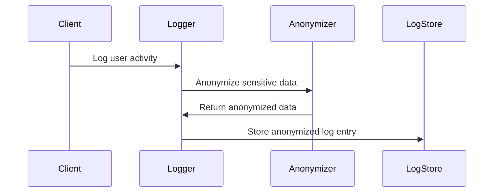

Anonymized Logging is a crucial design pattern within the domain of audit logging, primarily focused on protecting privacy by removing or masking personal identifiers found in log data. With the heightened focus on data privacy and protecting user's personal information, anonymized logging is not just a good practice, but often a regulatory requirement.

## Detailed Explanation

In modern applications, logging is indispensable for understanding system behaviors, debugging issues, and tracking operational metrics. However, logs often contain sensitive data that, if exposed, could lead to privacy violations. Anonymized logging addresses this challenge by ensuring that logs do not expose personally identifiable information (PII) or sensitive data. This involves transforming or obfuscating data so it cannot be traced back to individuals without additional personal information.

### Techniques for Anonymized Logging:
1. **Data Masking**: Masking elements of data, such as hashing email addresses or phone numbers with MD5 or SHA-256 algorithms.
2. **Tokenization**: Replacing sensitive data elements with unique identification symbols (tokens).
3. **Pseudonymization**: Substituting names or identifiers with pseudonyms as placeholder values.
4. **Data Redaction**: Permanently altering or removing sensitive parts of log entries.

### Best Practices:
- Implement an anonymization routine at log creation to prevent exposure at any level.
- Use cryptographic hashing techniques for constant-weight pseudonym generation.
- Log data should be further processed and securely stored to prevent unauthorized access.
- Ensure compliance with legislations like GDPR, HIPAA, or CCPA that mandate data anonymity and privacy.

## Example Code

Here is an example using Java to demonstrate how you might hash a user ID for anonymization in logs:

```java
import java.security.MessageDigest;
import java.security.NoSuchAlgorithmException;

public class AnonymizedLogging {

    public static String hashUserId(String userId) {
        try {
            MessageDigest digest = MessageDigest.getInstance("SHA-256");
            byte[] hash = digest.digest(userId.getBytes());
            StringBuilder hexString = new StringBuilder();
            for (byte b : hash) {
                hexString.append(String.format("%02x", b));
            }
            return hexString.toString();
        } catch (NoSuchAlgorithmException e) {
            throw new RuntimeException("Error while hashing User ID", e);
        }
    }

    public static void logAnonymizedData(String userId, String message) {
        String anonymizedUserId = hashUserId(userId);
        System.out.println("Log Entry: [UserID=" + anonymizedUserId + "] " + message);
    }

    public static void main(String[] args) {
        logAnonymizedData("123456789", "User logged in successfully.");
    }
}
```

## Diagrams

Here is a sequence diagram depicting the flow of anonymized logging in an application:



## Related Patterns

- **Secure Logging**: Focuses on ensuring log files themselves are secured from unauthorized access.
- **Pseudonymization Strategies**: Often used alongside anonymization techniques.

## Additional Resources

- [GDPR Anonymization Techniques](https://gdpr.eu/article-4/)
- [The NIST Guide to General Security Protocols](https://www.nist.gov/publications)
- [OWASP Logging Cheat Sheet](https://owasp.org/www-project-cheat-sheets/cheatsheets/Logging_Cheat_Sheet.html)

## Summary

Anonymized Logging is an essential pattern to integrate privacy-centric operations within logging frameworks of applications. It secures sensitive data by implementing anonymization techniques making data collections compliant with privacy regulations, maintaining user trust, and protecting them from potential data breaches.

This design pattern requires careful implementation and review to adequately address all kinds of sensitive information that logs may inadvertently capture, ensuring data privacy obligations are upheld end-to-end.
