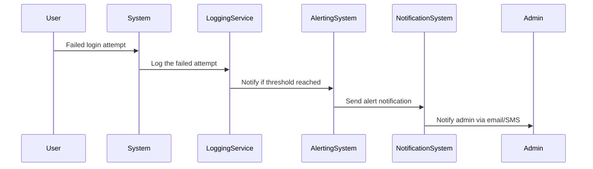

## Description

Alerting mechanisms are crucial components of modern cloud architectures and security frameworks. They are used to automatically monitor system behaviors, identify potentially harmful patterns, and notify administrators or other stakeholders when certain predefined conditions occur. These systems help in maintaining the security, performance, and reliability of the application. Implementing an effective alerting mechanism involves continuous monitoring, data analysis, and communication processes to ensure real-time responsiveness to atypical events, such as security breaches, system failures, or unexpected patterns.

## Architectural Approaches

1. **Event-Driven Architecture**:
   - Utilize event stream processing systems like Apache Kafka or AWS Kinesis to process streams of log data in real-time.
   - Deploy stream processing tools like Apache Flink or Apache Storm to filter and analyze events against predefined criteria.

2. **Rule-Based Alerting**:
   - Implement rules in systems like Prometheus Alertmanager, AWS CloudWatch Alarms, or Datadog that define threshold-based alerts.
   - Use rule engines or expression languages (e.g., JEXL, MVEL) to craft complex conditions for alert triggering.

3. **Machine Learning-Based Alerting**:
   - Develop anomaly detection models to identify deviations from normal behavior that could indicate security threats or system failures.
   - Use platforms like AWS SageMaker or GCP AI Platform for deploying machine learning models in production.

4. **Scalable Notification System**:
   - Integrate with messaging systems (e.g., Amazon SNS, Google Pub/Sub) to distribute alert messages to various channels such as email, SMS, or webhook to incident management tools like PagerDuty.

## Example Code

Here is a basic example using AWS CloudWatch to set up an alerting mechanism for failed login attempts:

```yaml
resources:
  - type: "AWS::Cloudwatch::Alarm"
    properties:
      AlarmName: "FailedLoginAttemptsAlarm"
      MetricName: "FailedLoginAttempts"
      Namespace: "MyApp/LogMetrics"
      Statistic: "Sum"
      Period: 300
      EvaluationPeriods: 1
      Threshold: 10
      ComparisonOperator: "GreaterThanOrEqualToThreshold"
      AlarmActions:
        - "arn:aws:sns:us-west-2:123456789012:EmailNotificationTopic"
```

## Diagram



## Related Patterns

1. **Event Sourcing**: Record each event in the system, enabling replay and analysis for auditing and alerting purposes.
2. **CQRS (Command and Query Responsibility Segregation)**: Separate read and write models to handle real-time query patterns for alerting.
3. **Circuit Breaker**: Prevent cascading failures, potentially integrating alerts when systems repeatedly fail.

## Additional Resources

- [AWS CloudWatch Documentation](https://docs.aws.amazon.com/cloudwatch/)
- [Apache Kafka Guide for Event Streaming](https://kafka.apache.org/documentation/)
- [Machine Learning with AWS SageMaker](https://aws.amazon.com/sagemaker/)

## Summary

Alerting Mechanisms serve as the backbone for proactive system monitoring, crucial for maintaining the integrity and reliability of modern applications. By using a combination of event-driven and rule-based architectures, as well as leveraging machine learning for anomaly detection, organizations can automatically respond to critical events effectively. Whether using cloud-native solutions or open-source tools, understanding and implementing alerting patterns form a fundamental part of robust software engineering practices.
