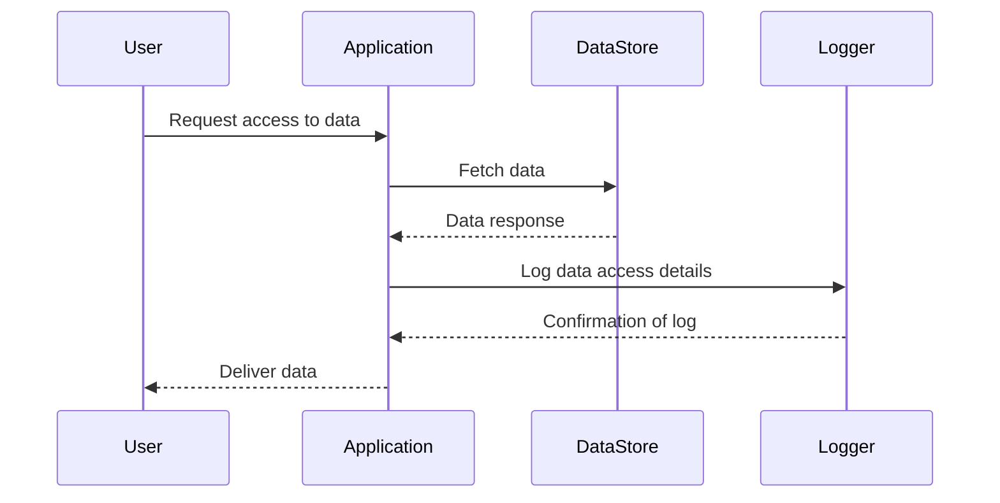

## Introduction

In today's data-driven environments, maintaining comprehensive access logs is a critical component of security and compliance. These logs track when data is accessed, not just altered, providing key insights into how sensitive information is used and helping to meet regulatory requirements such as GDPR and HIPAA.

## Problem Statement

Traditional logging systems often focus on changes made to the data. However, in many scenarios, it is just as important, if not more, to track read operations on sensitive data. Failing to track data access can lead to security vulnerabilities and non-compliance with industry regulations.

## Context

Many organizations handle data which, if accessed improperly, could lead to financial loss, damage to reputation, or legal obligations. Moreover, industries such as finance and healthcare are subject to strict regulations demanding detailed records of data access. 

## Solution

Implement Data Access Logs by capturing details each time data is read. This involves:

- Identifying data resources that require monitoring.
- Logging every read operation with details like timestamp, user ID, data accessed, and the method of access.
- Storing logs securely to prevent tampering.
- Regularly reviewing logs to identify any unauthorized access patterns.

### Example Implementation

To demonstrate a simple implementation, let's use a Java-based approach with a focus on a hypothetical customer database access:

```java
import java.time.LocalDateTime;

public class DataAccessLogger {

    public void logDataAccess(String userId, String resourceId) {
        String logEntry = String.format("User %s accessed resource %s at %s", 
                userId, resourceId, LocalDateTime.now());
        writeLog(logEntry);
    }

    private void writeLog(String logEntry) {
        // Append the log entry to a persistent storage system
        System.out.println(logEntry); // For demonstration, use a print statement or write to a file
    }
}

// Usage
DataAccessLogger logger = new DataAccessLogger();
logger.logDataAccess("user123", "customerRecord456");
```

### Diagram



## Best Practices

- **Granular Logging**: Capture specific data-access events rather than broad logging statements.
- **Efficient Storage**: Use compressed formats or specialized logging storage services to handle large volumes of logs.
- **Automated Monitoring**: Implement automated monitoring and alerting for patterns that indicate potential security incidents.

## Related Patterns

- **Data Change Logs**: Focuses on capturing changes rather than access, but often used in conjunction with access logs.
- **Audit Trail**: Broader than data access logs, audit trails include logs of all transactions and system use.
- **Security Event Logs**: Captures security-related events like failed login attempts or firewall breaches.

## Additional Resources

1. [Logging and Monitoring at Scale - AWS Whitepapers](https://aws.amazon.com/whitepapers/)
2. [GDPR Compliance Guidelines](https://gdpr-info.eu/)
3. [Introduction to Audit Logs by Google Cloud](https://cloud.google.com/logging/docs/audit)

## Conclusion

Data Access Logs are indispensable for maintaining security and regulatory compliance in modern data ecosystems. Implementing these logs strategically ensures that organizations have a clear record of data usage, which is foundational for protecting sensitive information and meeting compliance standards. Properly designed and managed, Data Access Logs offer critical insights into the access patterns on vital datasets, allowing for enhanced security measures and improved data governance.
