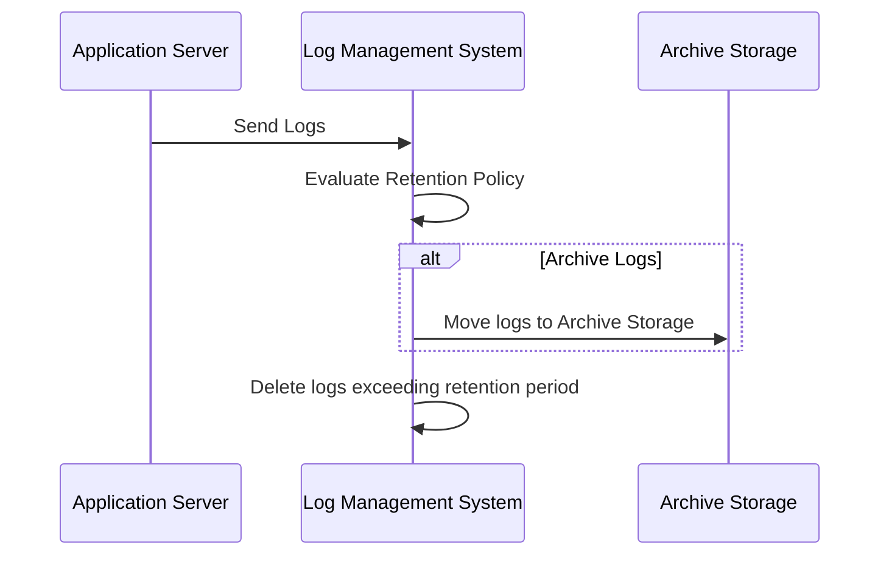

## Log Retention Policies

In today's digital world, organizations generate significant amounts of log data. These logs are crucial for auditing, compliance, troubleshooting, and security purposes. However, managing the lifecycle of log data—deciding how long logs should be retained before they are deleted—is a critical challenge. This is where log retention policies come into play, which are strategies that help define and enforce how long certain logs are kept.

### Importance of Log Retention Policies

Log retention policies need to address several organizational and legal needs:

1. **Regulatory Compliance**: Various industries are subject to regulations like GDPR, HIPAA, and SOX that mandate the retention period of logs related to financial transactions, personal data access, etc.
2. **Security**: Retaining logs helps in forensic analysis after security incidents.
3. **Cost Management**: Storing logs indefinitely is cost-prohibitive. Efficient policies balance the need to retain logs for operational requirements with storage costs.
4. **Data Governance**: Enable organizations to manage the data lifecycle effectively.

### Design Considerations

- **Log Category**: Different logs may have different retention requirements (e.g., error logs vs. transaction logs).
- **Storage Costs**: Consider the cost implication of storage solutions, which could be drastically different across on-premises, cloud, or a hybrid setup.
- **Data Volume**: The volume of generated log data impacts the storage strategy.
- **Access Frequency**: More frequently accessed log data might be prioritized for quicker retrieval mechanisms.
- **Legal Requirements**: Understand and comply with industry-specific legal requirements for data retention.
- **Archiving and Deletion**: Define the process and frequency for archiving logs not frequently accessed and deleting logs past their retention period.
- **Monitoring and Auditing**: Set up mechanisms to monitor policy adherence and audit data access to ensure compliance.

### Example

```bash
# This script demonstrates a simple retention policy where logs older than specified days are deleted.

LOG_PATH="/var/log/myapp"
RETENTION_DAYS=90

find $LOG_PATH -type f -name "*.log" -mtime +$RETENTION_DAYS -exec rm -f {} \;
```

### Diagram

Here's a Mermaid Sequence Diagram illustrating an automated log retention workflow:



### Related Patterns

- **Data Archiving Pattern**: Focuses on moving inactive data to a more suitable storage solution, which is often cheaper and more efficient.
- **Data Lifecycle Management**: Comprehensive management of the data throughout its lifecycle from creation to deletion.
- **Audit Logging Pattern**: Encompasses collecting logs for security and compliance auditing.

### Additional Resources

- [NIST Guide for Log Management](https://nvlpubs.nist.gov/nistpubs/Legacy/SP/nistspecialpublication800-92.pdf)
- [AWS CloudTrail Log Retention](https://docs.aws.amazon.com/awscloudtrail/latest/userguide/cloudtrail-log-retention.html)
- [Azure Monitor's Log Data Retention](https://docs.microsoft.com/en-us/azure/azure-monitor/logs/data-retention)
- [Google Cloud Logging Retention](https://cloud.google.com/logging/docs/retention)

### Summary

Log Retention Policies are crucial for effective data management, compliance with regulations, and optimizing storage costs. Implementing a clear log retention strategy helps balance these aspects by specifying how long different types of logs should be kept and safely removing them once they are no longer needed. By incorporating best practices in monitoring, auditing, and automated workflows, organizations can maintain compliance and efficient data governance.
