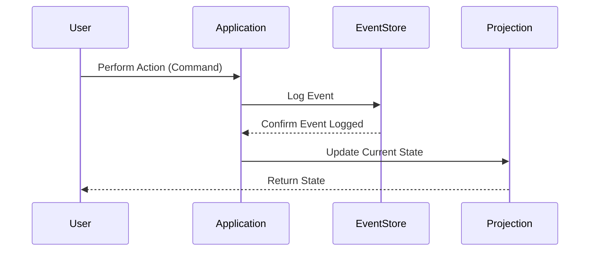

## Description
Event Sourcing is a design pattern that involves storing every state-changing event as a persistent sequence. This allows you to reconstruct the data state at any given point in time by replaying all of these events. This technique is especially useful for maintaining a robust audit trail, debugging complex systems, and reconstructing historical data states without relying on traditional row-level versioning seen in conventional databases.

## Architectural Approaches
1. **Event Storage**: Instead of persisting current state, the method logs all changes (events) to a durable store. Common technologies include Apache Kafka for message durability, or databases like EventStore and Cassandra designed for large-scale event storage.
   
2. **Projection**: Real-time projections of current state can be created by replaying events to form a view that applications can interact with, enabling them to consume data as if it was in its traditional form.

3. **Command Query Responsibility Segregation (CQRS)**: Typically used in conjunction with Event Sourcing, CQRS separates commands (updates) and queries (reads). By using separate data models for commands and queries, the system can be optimized for performance and scalability.

## Best Practices
- **Idempotency**: Ensure that the event handler logic remains idempotent, as events might be played repeatedly, requiring the same system state after each execution.

- **Snapshotting**: Periodically create snapshots of the entire system state to improve system performance without reprocessing an unbounded list of events for commonly accessed states.

- **Event Schema Evolution**: Develop strategies for evolving the event schema, such as using version fields or event transformation pipelines to maintain backward compatibility.

- **Security and Compliance**: Implement encryption and access controls, especially in sensitive data environments to ensure that event data maintains confidentiality and integrity.

## Example Code

### Java Pseudocode

```java
class BankAccount {
    private UUID accountId;
    private BigDecimal balance;
    private List<Event> changes;

    public BankAccount(UUID accountId) {
        this.accountId = accountId;
        this.changes = new ArrayList<>();
    }

    public void deposit(BigDecimal amount) {
        apply(new DepositEvent(accountId, amount));
    }

    public void withdraw(BigDecimal amount) throws Exception {
        if (balance.compareTo(amount) < 0) throw new Exception("Insufficient balance");
        apply(new WithdrawEvent(accountId, amount));
    }

    private void apply(Event event) {
        if (event instanceof DepositEvent) {
            balance = balance.add(((DepositEvent) event).getAmount());
        } else if (event instanceof WithdrawEvent) {
            balance = balance.subtract(((WithdrawEvent) event).getAmount());
        }
        changes.add(event);
    }

    public List<Event> getUncommittedChanges() {
        return changes;
    }

    public void loadFromHistory(List<Event> history) {
        for (Event event : history) {
            apply(event);
        }
    }
}
```

## Diagrams

### Event Sourcing Flow (Mermaid Sequence Diagram)



## Related Patterns
- **CQRS (Command Query Responsibility Segregation)**: Helps with separating read and write operations, often implemented alongside Event Sourcing for increased performance and flexibility.
- **Snapshotting**: Captures system state at specific points to optimize the replay of events and bolster event sourcing processes.

## Additional Resources
- [Martin Fowler's Article on Event Sourcing](https://martinfowler.com/eaaDev/EventSourcing.html)
- [EventStore](https://eventstore.com/)
- [CQRS Documentation](https://docs.microsoft.com/en-us/azure/architecture/patterns/cqrs)

## Summary
Event Sourcing affords an immutable, verifiable log of all state-changing events within a system, enabling accurate state reconstruction and offering unprecedented auditability and debugging capabilities. However, it demands careful planning and consideration of data schema evolution, idempotency, and data protection standards. When paired with patterns like CQRS, it provides a robust architecture conducive to high-load, high-integrity applications.
