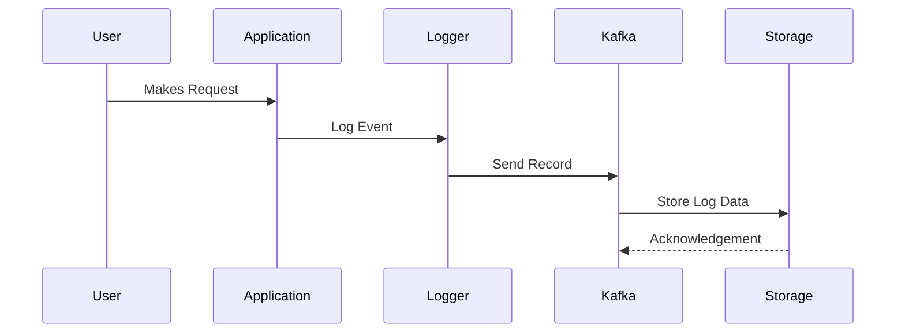

## Forensic Logging

### Introduction

Forensic Logging is a strategic approach to logging designed to capture a comprehensive log of system activities and transactions, which can be pivotal in post-incident investigations. It’s particularly vital in environments where understanding the minutiae of operations is crucial for security and compliance.

### Design Pattern Overview

- **Intent**: To provide a detailed trail of activities within a system to facilitate forensic analysis and support investigations after security incidents or breaches.
- **Context**: With increasing cybersecurity threats and regulatory requirements, organizations must ensure they have sufficient logging and audit mechanisms in place to dissect system and user activities methodically.
- **Problem**: Traditional logging mechanisms may not capture enough detail to reconstruct events leading to security incidents, thus impeding thorough investigations and compliance reporting.
  
### Architectural Approach

Forensic Logging can be architected by incorporating the following components:

1. **Comprehensive Data Capture**: All relevant data should be logged, including API calls, user requests, database queries, system faults, and more. Structures should be put in place to capture headers, payloads, metadata, and contextual information.

2. **Real-time Processing and Storage**: Leverage distributed, scalable logging pipelines (e.g., using Apache Kafka for streaming) and storage solutions (e.g., AWS S3, Azure Blob Storage) to ensure data is captured and stored efficiently for future retrieval and analysis.

3. **Security and Integrity**: Implement encryption and hash verification to ensure the integrity and confidentiality of log data. Utilizing blockchain technologies could provide immutable logging solutions, enhancing trust and verifiability.

4. **Retention and Searchability**: Enforce an appropriate retention strategy aligned with compliance requirements while ensuring logs are easily searchable via indexed querying (e.g., using Elasticsearch).

### Example Implementation

```java
import org.apache.kafka.clients.producer.*;
import java.util.Properties;

public class ForensicLogger {
    private final KafkaProducer<String, String> producer;
    private final String topic = "forensic_logs";

    public ForensicLogger() {
        Properties props = new Properties();
        props.put("bootstrap.servers", "localhost:9092");
        props.put("key.serializer", "org.apache.kafka.common.serialization.StringSerializer");
        props.put("value.serializer", "org.apache.kafka.common.serialization.StringSerializer");
        this.producer = new KafkaProducer<>(props);
    }

    public void logEvent(String key, String event) {
        ProducerRecord<String, String> record = new ProducerRecord<>(topic, key, event);
        producer.send(record);
    }

    public void close() {
        producer.close();
    }

    public static void main(String[] args) {
        ForensicLogger logger = new ForensicLogger();
        logger.logEvent("user123", "{ \"action\": \"login\", \"status\": \"success\" }");
        logger.close();
    }
}
```

### Diagrams

#### Forensic Logging Implementation Sequence Diagram



### Related Patterns

- **Event Sourcing**: Records the state changes of a system as events, potentially useful in conjunction with forensic logs for comprehensive system understanding.
- **Audit Trail**: Similar to forensic logging, but often used for financial or regulatory conformities to track who did what and when.

### Additional Resources

- [NIST Special Publication 800-92: Guide to Computer Security Log Management](https://csrc.nist.gov/publications/detail/sp/800-92/final)
- [AWS Logging Best Practices](https://aws.amazon.com/architecture/security-logging/)
- [GDPR Logging and Forensics](https://gdpr.eu/)

### Summary

Forensic Logging is essential for organizations needing to gain deep insights into their systems' operations post-incident. By leveraging comprehensive data capture, real-time processing, and robust storage solutions, businesses can ensure they're adequately prepared for forensic analysis while maintaining compliance and security standards. This pattern is crucial in today’s security landscape, offering an invaluable tool for understanding and preventing future security threats.
