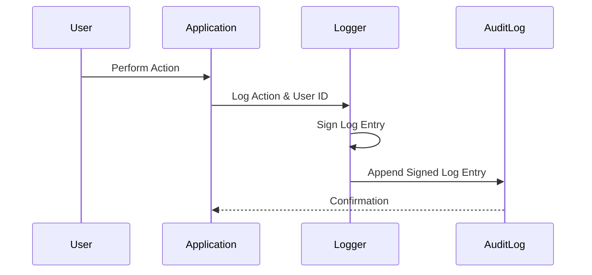

---

linkTitle: "Non-Repudiation"
title: "Non-Repudiation"
category: "Audit Logging Patterns"
series: "Data Modeling Design Patterns"
description: "Ensuring that log records are undeniable by the user who performed the action for authenticity and accountability, using cryptographic techniques."
categories:
- Audit Logging Patterns
- Security
- Data Integrity
tags:
- Non-Repudiation
- Digital Signatures
- Logging
- Security
- Cryptography
date: 2024-07-07
type: docs

canonical: "https://softwarepatternslexicon.com/103/6/21"
license: "© 2024 Tokenizer Inc. CC BY-NC-SA 4.0"
---

## Introduction

Non-Repudiation is an essential pattern in secure and reliable systems, aimed at ensuring that once an entity performs an action, they cannot later deny having performed that action. This pattern is crucial for creating audit trails that are trustworthy, especially in environments where accountability and legal compliance are required.

## Description

The Non-Repudiation design pattern involves using techniques such as digital signatures, hashing algorithms, and secure logging mechanisms to ensure that every logged action is tagged with the identity of the action performer in an unalterable way. By integrating non-repudiation patterns, logs provide verifiable evidence about the operations performed within systems, ensuring both transparency and accountability.

## Architectural Approach

1. **Digital Signatures**: Use cryptographic digital signatures to sign log entries. Each log entry includes the action details and the signature of the individual who performed the action. This allows verification that both the content and the signer are authentic.
  
2. **Immutable Logging**: Store log entries in an immutable format where records cannot be altered without detection. This can be achieved using append-only storage mechanisms or blockchain technologies to maintain integrity.

3. **Timestamping**: Attach accurate timestamps to each log entry. Timestamps, when combined with digital signatures, ensure the temporal correctness of the records.

4. **Audit Trail Frameworks**: Implement frameworks that automatically capture and log required details with minimum latency to reduce the risk of missed entries.

## Example Code

```java
import java.security.PrivateKey;
import java.security.Signature;
import java.util.Base64;
import java.nio.charset.StandardCharsets;

public class AuditLogger {

    private PrivateKey privateKey;

    public AuditLogger(PrivateKey privateKey) {
        this.privateKey = privateKey;
    }

    public String signLogEntry(String logEntry) throws Exception {
        Signature signer = Signature.getInstance("SHA256withRSA");
        signer.initSign(privateKey);
        signer.update(logEntry.getBytes(StandardCharsets.UTF_8));
        byte[] digitalSignature = signer.sign();
        return Base64.getEncoder().encodeToString(digitalSignature);
    }

    public void logAction(String actionDetails) {
        try {
            String signature = signLogEntry(actionDetails);
            // Log entry: [actionDetails, signature]
            System.out.println("Logged: " + actionDetails + " Signature: " + signature);
        } catch (Exception e) {
            e.printStackTrace();
        }
    }
}
```

## Diagram

Below is a UML Sequence diagram illustrating the non-repudiation logging process:



## Related Patterns

- **Secure Logging**: A pattern focusing on securely storing log data to prevent tampering and exposure.
- **Audit Trail**: Provides a comprehensive view of the history of actions or changes to ensure full traceability.
- **Data Integrity**: Ensures data remains accurate and consistent over its lifecycle.

## Additional Resources

- [NIST Digital Signature Guidelines](https://nvlpubs.nist.gov/nistpubs/Legacy/SP/nistspecialpublication800-89.pdf)
- [OWASP Cryptographic Storage Cheat Sheet](https://cheatsheetseries.owasp.org/cheatsheets/Cryptographic_Storage_Cheat_Sheet.html)
- [Data Integrity and Non-Repudiation](https://www.isaca.org/resources/isaca-journal/past-issues/2019/data-integrity-and-nonrepudiation)

## Summary

Non-Repudiation is a critical design pattern that augments security and trust in systems by ensuring actions are permanently attributable to their respective performers. This is achieved through the use of cryptographic digital signatures and immutable logging practices, thus enabling robust auditability and accountability. By implementing such measures, organizations can safeguard against disputes and unauthorized alterations of event records, ensuring compliance with stringent legal and regulatory standards.
