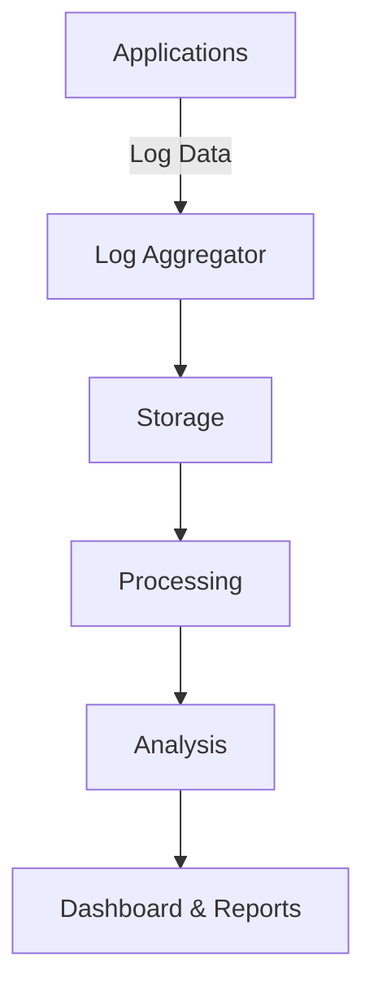

## Overview

The "Log Analysis and Reporting" design pattern focuses on the analysis of collected logs to identify trends, patterns, anomalies, or other notable data points that can inform management decisions, security measures, or system optimizations. In a cloud environment, where systems can generate vast amounts of log data, effective log analysis and reporting are crucial for maintaining system health, compliance, and performance.

## Architectural Approach

Log analysis involves the collection and examination of log data produced by applications, servers, and network devices. In a cloud setup, logs can be produced in real-time, and services must be set up for collecting, storing, and processing them efficiently. Typically, this involves using a combination of batch processing and real-time stream processing techniques:

1. **Data Collection**: Implement log aggregation solutions such as Fluentd, Logstash, or native cloud logging services (e.g., AWS CloudWatch Logs, Google Cloud Logging) to centralize logs from different services.

2. **Storage**: Store logs in scalable storage systems capable of handling large volumes of data, such as Amazon S3, Google Cloud Storage, or Azure Blob Storage.

3. **Processing**: Utilize big data frameworks like Apache Kafka, Flink, or Google's BigQuery for real-time or batch processing.

4. **Analysis**: Employ machine learning models or statistical methods to analyze logs, identifying patterns or anomalies.

5. **Reporting**: Generate reports using BI tools like Tableau, Looker, or open-source options like Grafana. These tools help visualize trends and anomalies detected during analysis.

## Best Practices

- **Schema Normalization**: Ensure logs adhere to a consistent schema to facilitate effective aggregation and analysis.

- **Retention Policies**: Define clear retention policies to manage storage costs while retaining necessary historical data for trend analysis.

- **Security and Compliance**: Implement data security measures and ensure compliance with relevant regulations (such as GDPR or HIPAA) by anonymizing sensitive log data and securing access.

- **Automated Alerts**: Set up automated alerts and dashboards for real-time notifications on detected anomalies or patterns to facilitate quick responses.

## Example Code

Below is an example using Python and the ELK stack (Elasticsearch, Logstash, and Kibana) for setting up a basic log analysis and reporting architecture.

```python
import logging
import time

logging.basicConfig(filename='app.log', filemode='a', format='%(name)s - %(levelname)s - %(message)s')

def process_data():
    for i in range(10):
        logging.info(f"Processing data item {i}")
        time.sleep(1)

if __name__ == '__main__':
    process_data()

# Logstash configuration file ('logstash.conf') example:

#   file {
#     start_position => "beginning"
# }
#   grok {
#   }
# output {
#     hosts => ["localhost:9200"]
#   }

```

## Diagrams

### Log Analysis and Reporting Architecture



## Related Patterns

- **Centralized Log Management**: Involves aggregating log data from various services into a centralized system.
- **Real-time Monitoring**: Focuses on the instant processing and alert generation on specific conditions in log data.
- **Anomaly Detection**: Uses machine learning to detect unusual patterns in logs indicating potential issues.

## Additional Resources

- [Elastic Stack Documentation](https://www.elastic.co/guide/index.html)
- [Google Cloud Operations Suite](https://cloud.google.com/products/operations)
- [AWS CloudWatch Logs](https://aws.amazon.com/cloudwatch/)

## Final Summary

The "Log Analysis and Reporting" pattern accelerates the ability to provide meaningful insights from large volumes of log data, helping organizations maintain operational efficiency, enhance security, and support compliance initiatives. By implementing this pattern, enterprises can leverage their log data for proactive decision-making and operational enhancements in their cloud environments.
