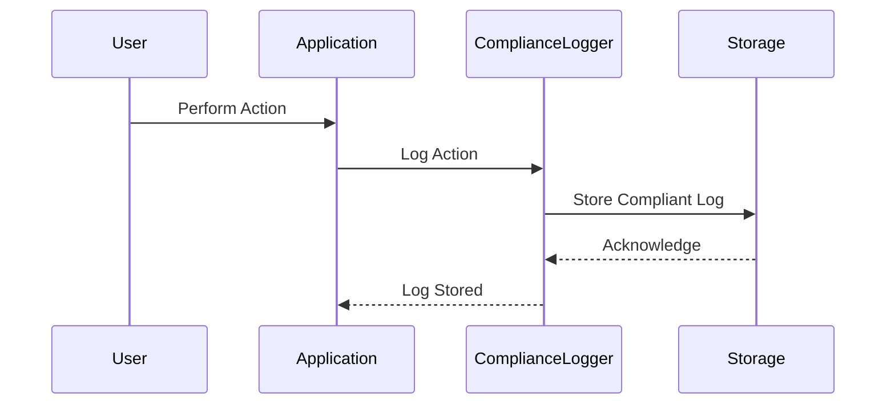

## Introduction

Compliance Logging is a design pattern used to ensure that logging mechanisms within an application meet necessary industry standards and regulatory requirements. This pattern focuses on systematically collecting, storing, and analyzing log data, necessary to prove compliance with regulations such as GDPR, HIPAA, PCI-DSS, and others traditionally imposed by industry-specific bodies or government regulations.

## Detailed Explanation

Compliance Logging mandates logging practices that record data in a manner aligned with compliance needs. This typically involves careful curation of what is logged, ensuring sensitive information is adequately protected or anonymized but still allows for a traceable action record if required for audits. Additionally, logs must be stored with a lifecycle that meets or exceeds regulatory data retention requirements while allowing for secure data disposal at the end of its life.

### Key Components

- **Data Selection**: Identify the critical data points required for compliance. This step ensures only the necessary information is logged, minimizing storage costs and data privacy risks.
  
- **Protection & Anonymization**: Implement strategies for encrypting or anonymizing personally identifiable information (PII) to safeguard user privacy as per compliance requirements.

- **Storage & Retention**: Logs must be saved in a secure and durable storage system that aligns with the compliance mandates governing data retention periods and assures data immutability.

- **Access & Security**: Entrust access control measures ensuring only authorized individuals can access or audit logs. Use cryptographic techniques and maintain audit trails of access events.

- **Audit & Reporting**: Develop audit and reporting tools that allow for efficient log analysis when demonstrating compliance during inspections.

## Example Code

Here is a simplified example of compliance logging using Scala with a fictional logging library:

```scala
import com.example.logging.ComplianceLogger

object HealthcareSystem {
  
  // Initialize the compliance logger
  private val logger = ComplianceLogger("HIPAA-Logger")

  def recordPatientActivity(patientId: String, activity: String): Unit = {
    // Log the patient's activity with necessary compliance logs
    logger.log(s"Patient ID: $patientId performed $activity", sensitiveData = true)
  }
}

// Mock Logging Class for Compliance
class ComplianceLogger(private val name: String) {
  def log(message: String, sensitiveData: Boolean): Unit = {
    val loggedMessage = if (sensitiveData) anonymizeData(message) else message
    println(s"[${name}] - ${loggedMessage}")
    // Secure storage for the compliance logs.
  }

  private def anonymizeData(message: String): String = {
    // Anonymization logic goes here
    message.replaceAll("\\b\\d+\\b", "XXXX")
  }
}
```

## Diagram



## Related Patterns

- **Audit Trail Pattern**: Logs all access and actions taken on resources in the system.
- **Data Masking Pattern**: Anonymizes sensitive data fields within logs to meet compliance without obstructing functionality.
- **Immutable Log Pattern**: Ensures logs can't be altered post-creation to provide a tamperproof audit trail.

## Additional Resources

- [GDPR Compliance Principles](https://gdpr.eu/)
- [HIPAA Regulations Summary](https://www.hhs.gov/hipaa/index.html)
- [PCI-DSS Compliance Guide](https://www.pcisecuritystandards.org/)

## Summary

Compliance Logging is vital for any organization dealing with sensitive user data and industry regulations. It involves creating a structured logging approach that aligns with compliance requirements for data responsibility. Key aspects of this pattern include having privacy-safe log content, adequate protection, and meeting the retention policy, as necessitated by the regulatory framework governing the domain of the application.
