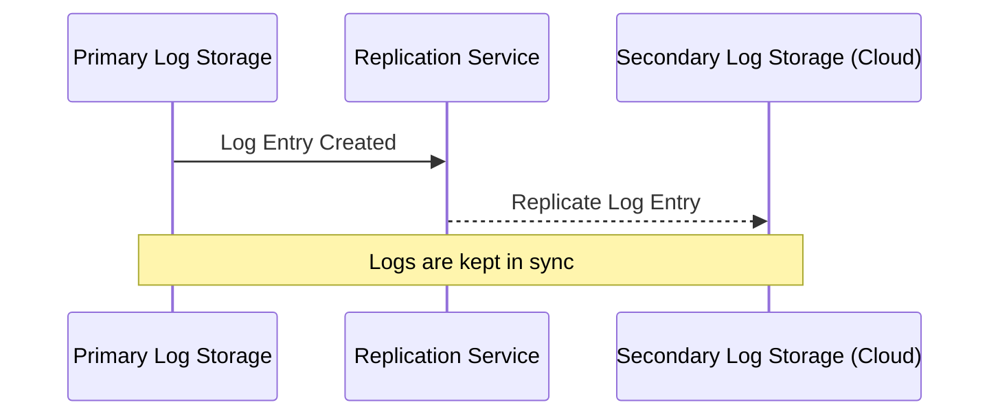

---

linkTitle: "Log Redundancy"
title: "Log Redundancy"
category: "Audit Logging Patterns"
series: "Data Modeling Design Patterns"
description: "Duplicating logs in multiple locations to prevent data loss."
categories:
- Audit Logging
- Data Modeling
- Redundancy
tags:
- Data Loss Prevention
- Disaster Recovery
- Log Management
- High Availability
- Fault Tolerance
date: 2024-07-07
type: docs

canonical: "https://softwarepatternslexicon.com/103/6/24"
license: "© 2024 Tokenizer Inc. CC BY-NC-SA 4.0"
---

## Introduction

Log redundancy is a crucial practice in ensuring robustness and reliability within a cloud computing environment. It involves storing log data in multiple locations to prevent data loss, which is integral for disaster recovery, forensics, compliance, and maintaining system integrity. Organizations leverage this pattern to enhance fault tolerance and ensure continuous service availability.

## Detailed Explanation

### Design Pattern Overview

Log redundancy focuses on replicating logs across diverse storage mediums and geographical locations. By having logs stored in multiple locations, systems gain resilience against failures such as data corruption, hardware failures, or cyberattacks that could otherwise lead to loss of critical log information.

### Key Components

1. **Primary Storage**: The initial location where log data is first recorded. This is usually a fast and accessible storage solution to ensure that logging does not impact performance.
  
2. **Secondary Storage**: An alternative location which could be a remote server or a cloud-based solution to store replicated log data. These storages are chosen based on availability, durability, and accessibility criteria.

3. **Replication Mechanism**: The method or tool used to replicate logs from the primary to the secondary storage. This can be synchronous, ensuring immediate replication, or asynchronous, providing consistency over time but with less delay.

### Architectural Approaches

- **Synchronous Replication**: Every log entry written to the primary storage is immediately replicated to one or more secondary storages. This approach ensures that all storage locations are in sync at any given time, although it could introduce latency.

- **Asynchronous Replication**: Logs are replicated to secondary locations after they have been written to the primary storage. This approach minimizes latency at the cost of potential data loss in the event of a system failure between updates.

### Best Practices

- **Choose Redundancy Levels Based on Need**: Depending on the critical nature of the logs, define the redundancy level—simple dual-location storage might suffice for less critical logs, whereas critical logs might require more complex redundant arrays with geographic dispersion.

- **Secure Transfer Protocols**: Employ secure methods for transferring log data, such as HTTPS, to ensure data integrity and confidentiality during replication.

- **Regular Testing and Validation**: Regularly test your redundancy system to ensure logs are properly replicated and accessible when needed. Implement automated checks where possible to mitigate manual oversight.

## Example Use Case

Consider a financial services application that logs every transaction for audit purposes. To ensure these logs are never lost, the applications store logs first on local SSD storage for fast access and then asynchronously replicate these logs to a remote data center hosted on AWS S3, ensuring high durability and access from multiple regions. In the event of a local storage failure, the logs remain accessible from the AWS location, maintaining audit compliance and service reliability.

## Diagrams

## Related Patterns

- **Log Aggregation**: Consolidating logs from different sources into a centralized platform to simplify querying and analysis.
- **Log Anonymization**: Removing or obfuscating sensitive information within logs to ensure compliance with privacy regulations.

## Additional Resources

1. *Disaster Recovery and Business Continuity Guide* - AWS Whitepapers
2. *The Log: What every software engineer should know about real-time data's unifying abstraction* - by Jay Kreps

## Summary

Log redundancy is a foundational design pattern for businesses that require high availability, reliability, and security. By ensuring that logs are duplicated across varied locations and ensuring proper management of these duplicates, organizations can safeguard against data loss and maintain system operability even in adverse situations. This pattern is an essential component in comprehensive data protection and disaster recovery strategies.

---
