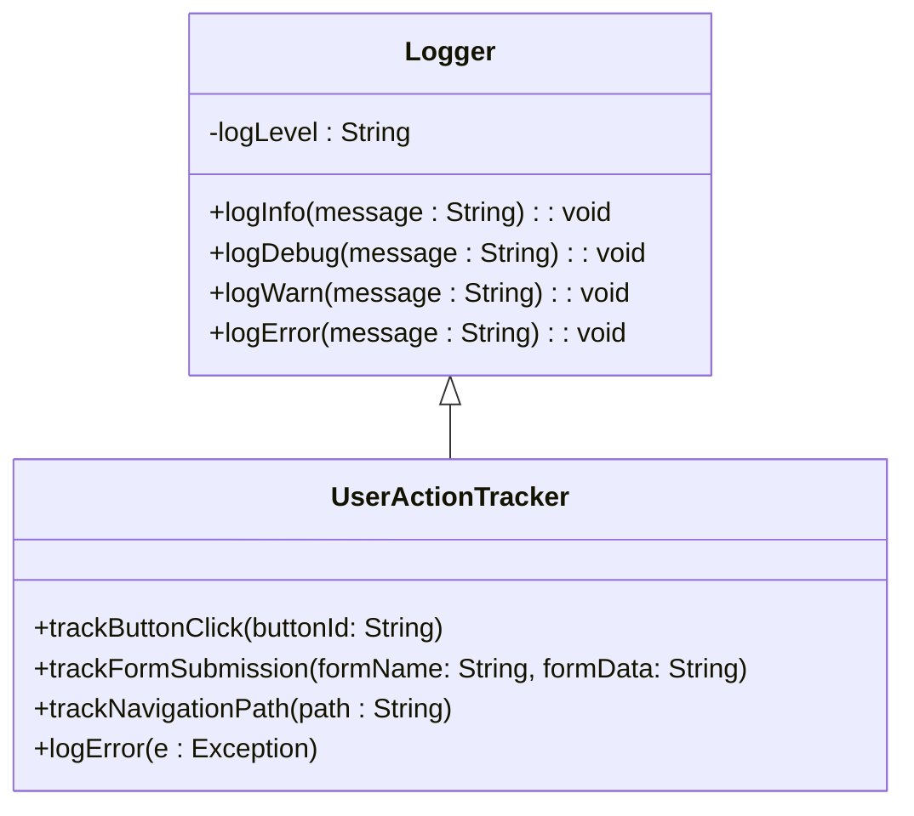

## Application-Level Logging

Application-Level Logging is a critical design pattern that involves capturing and storing logs from the application layer, focusing particularly on user interactions, application events, and potential errors. This pattern is crucial for monitoring the health of applications, troubleshooting issues, and gaining insights into user behaviors. 

### Detailed Explanation

#### Architectural Approach

Application-Level Logging is implemented by embedding logging mechanisms directly within the application code, utilizing logging frameworks and libraries that are tailored for different programming languages. Common choices include **Log4j** for Java, **SLF4J**, **Python's logging module**, and **JavaScript's console object**. These frameworks provide fine-grained control over log levels (e.g., INFO, DEBUG, WARN, ERROR) and outputs (e.g., files, databases, remote servers).

#### Design Considerations

1. **Log Granularity**: Decide the level of detail to log. Too much detail can slow down the application and generate unnecessary data, while too little detail can make troubleshooting difficult.

2. **Log Formatting**: Use a consistent format, such as JSON, to make logs easily parsable and searchable across different tools and platforms.

3. **Asynchronous Logging**: To reduce the impact on application performance, handle logging asynchronously using background tasks or by buffering logs.

4. **Centralized Logging**: Consider centralizing logs using tools like **ELK Stack (Elasticsearch, Logstash, Kibana)** or **Amazon CloudWatch** to provide a unified view across applications.

5. **Security and Privacy**: Ensure sensitive information is masked or omitted from logs to comply with data protection regulations.

#### Example Code

Here is a simplistic example of how application-level logging can be implemented in a Java application using SLF4J:

```java
import org.slf4j.Logger;
import org.slf4j.LoggerFactory;

public class UserActionTracker {
    private static final Logger logger = LoggerFactory.getLogger(UserActionTracker.class);

    public void trackButtonClick(String buttonId) {
        logger.info("Button clicked: {}", buttonId);
    }

    public void trackFormSubmission(String formName, String formData) {
        logger.info("Form submitted: {} with data: {}", formName, formData);
    }

    public void trackNavigationPath(String path) {
        logger.info("User navigated to: {}", path);
    }

    public void logError(Exception e) {
        logger.error("An error occurred", e);
    }
}
```

### Diagrams

Below is a simple UML class diagram depicting the logging flow in a typical application:



### Related Patterns

- **Centralized Logging**: Aggregating logs from across different services or components into a central location for analysis.
- **Error Handling and Recovery Patterns**: Tactics to manage and recover from errors either gracefully or through fallback procedures.
- **Audit Trail**: Keeping a systematic record of system activity by users or other systems.

### Additional Resources

- [Log4j Documentation](https://logging.apache.org/log4j/2.x/)
- [SLF4J Documentation](http://www.slf4j.org/manual.html)
- [Python Logging Module](https://docs.python.org/3/library/logging.html)

### Summary

Application-Level Logging is a fundamental pattern for capturing application-specific events, errors, and interactions. By implementing effective logging practices, organizations can greatly enhance their ability to monitor applications, diagnose problems, and understand user actions. Focusing on granular log levels, asynchronous operations, and security considerations, this pattern sets a strong foundation for application monitoring and analytics.
