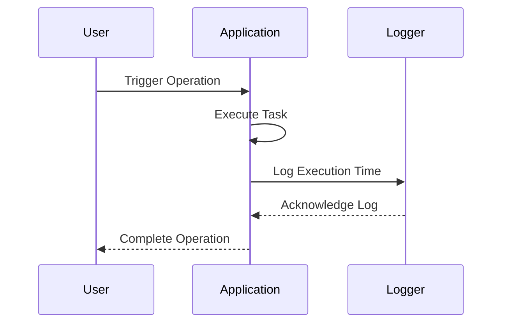

## Metadata Logging

### Introduction

Metadata Logging is a crucial design pattern for managing operational information such as execution time, resource utilization, and other vital statistics within a cloud-based system. This pattern can help in identifying performance bottlenecks, optimizing resource allocation, and improving the system's overall observability and maintainability.

### Detailed Explanation

In modern cloud architectures, observability is critical for maintaining system health and ensuring efficient operation. Metadata logging focuses on capturing essential metrics related to operations, including performance data (e.g., execution time, throughput) and resource consumption (e.g., CPU, memory use).

1. **Benefits**
   - **Performance Optimization**: Identify and resolve performance bottlenecks by analyzing operation metadata such as response times and resource usage.
   - **Cost Management**: Monitor and understand resource usage to optimize cloud resource allocation and potentially reduce costs.
   - **Enhanced Observability**: Improve system observability by collecting detailed operation logs, facilitating better incident resolution and root-cause analysis.
   - **Audit & Compliance**: Meet compliance requirements and audit trails by retaining operation metrics as part of organizational records.

2. **Implementation Considerations**
   - **Data Collection**: Decide on the granularity of metadata to capture, balancing between detail richness and overhead.
   - **Storage Strategy**: Use appropriate storage solutions for collected metadata (e.g., time-series databases, log management systems).
   - **Integration with Monitoring Tools**: Integrate metadata logs with existing monitoring and alerting platforms like Prometheus or CloudWatch for real-time insights.
   - **Scalability**: Ensure your logging infrastructure can scale with increased data flow as your application usage grows.

### Example Code

Below is a simplified example in Java demonstrating capturing execution time using a logging framework:

```java
import org.slf4j.Logger;
import org.slf4j.LoggerFactory;
import java.time.Instant;

public class MetadataLoggingExample {
    private static final Logger logger = LoggerFactory.getLogger(MetadataLoggingExample.class);

    public static void main(String[] args) {
        long startTime = Instant.now().toEpochMilli();
        
        // Simulated task or operation
        executeSampleTask();
        
        long endTime = Instant.now().toEpochMilli();
        long duration = endTime - startTime;
        
        logger.info("Task executed in {} ms", duration);
    }

    public static void executeSampleTask() {
        // Simulate work
        try {
            Thread.sleep(500); // Simulate delay
        } catch (InterruptedException e) {
            Thread.currentThread().interrupt();
        }
    }
}
```

### Diagram

Below is a Mermaid diagram explaining the sequence of logging metadata for an operation:



### Related Patterns

- **Event Sourcing**: Track the state changes as events, enhancing the observability of how operations affect your system.
- **Circuit Breaker**: Protect service calls, provide operational metadata for each attempt.
- **Performance Monitoring**: Build comprehensive performance views using logged metadata.

### Additional Resources

- **Book**: "Designing Data-Intensive Applications" by Martin Kleppmann
- **Article**: [Understanding Logging and Monitoring from a Cloud-Native Perspective](https://www.infoworld.com/article/3659644/understanding-logging-and-monitoring-from-a-cloud-native-perspective.html)
- **Video**: [Advanced Cloud Monitoring Techniques](https://www.youtube.com)

### Summary

The Metadata Logging pattern is invaluable for designing robust, observable, and maintainable cloud systems. By capturing and analyzing operation metadata, organizations can significantly optimize performance, streamline resource allocation, and enhance system understanding, paving the way for a resilient and cost-effective cloud journey.
