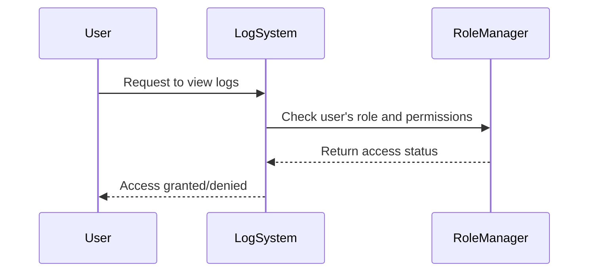

Ensuring the security and integrity of log data is crucial in cloud computing environments. By implementing access control measures on logs, we prevent unauthorized access, which could lead to data breaches or information leakage of sensitive information.

## Detailed Explanation

Access control on logs involves applying principles of the **least privilege** and **need-to-know** basis to logging data. This is to ensure that only individuals with the right privileges can access relevant log information, align logging with compliance requirements, and protect sensitive data.

### Key Components
- **Authentication**: Verify the identity of individuals attempting to access logs.
- **Authorization**: Determine if a user has permission to access the specific log data.
- **Role-Based Access Control (RBAC)**: Define user roles and grant permissions based on these roles.
- **Encryption**: Use encryption to secure log data at rest and during transmission.
- **Auditing and Monitoring**: Track who accesses logs for further security analysis.

## Architectural Approaches

1. **Centralized Logging Service**: Use a centralized system to collect and store logs, apply access controls, and manage permissions.
2. **Log Anonymization**: Implement anonymization techniques for logs containing sensitive information, reducing the risk of exposure.
3. **Access Control Policies**: Define policies using RBAC and enforce them across the logging infrastructure.
4. **Distributed Access Logging**: Log access attempts and modifications for forensic analysis and compliance audits.

## Best Practices

- Implement multi-factor authentication for accessing logs.
- Regularly review and update access control policies.
- Use encryption for both in-transit and at-rest log data.
- Maintain detailed logs of access attempts and changes for auditing.

## Example Code
Below is an example of implementing role-based access control for logs using a hypothetical logging system:

```java
public class LogAccessManager {

    private Map<String, Set<String>> rolePermissions;

    public LogAccessManager() {
        rolePermissions = new HashMap<>();
        // Define roles and permissions
        rolePermissions.put("SecurityAdmin", Set.of("read", "write", "delete"));
        rolePermissions.put("Auditor", Set.of("read"));
        rolePermissions.put("Developer", Set.of("read"));
    }

    public boolean checkAccess(String role, String operation) {
        return rolePermissions.getOrDefault(role, Collections.emptySet()).contains(operation);
    }
}

// Usage
LogAccessManager accessManager = new LogAccessManager();
if (accessManager.checkAccess(userRole, "read")) {
    // Allow access to the logs
    System.out.println("Access granted.");
} else {
    // Deny access to the logs
    System.out.println("Access denied.");
}
```

## Diagrams

### UML Sequence Diagram
Here's a simple sequence diagram illustrating the process of accessing logs with access control.



## Related Patterns

- **Audit Log Pattern**: Focuses on maintaining detailed logs for auditing purposes.
- **Anonymized Logging Pattern**: Helps in protecting sensitive information within logs.
- **Protected Command**: Controls modifications and deletions within critical logging systems.

## Additional Resources

- [AWS Identity and Access Management](https://aws.amazon.com/iam/)
- [Google Cloud IAM](https://cloud.google.com/iam)
- [Azure Active Directory](https://azure.microsoft.com/en-us/services/active-directory/)

## Summary

By implementing access control mechanisms on logs, organizations can safeguard sensitive data, comply with regulatory requirements, and mitigate risks associated with unauthorized access. Incorporating this pattern ensures robust security and reliable audit trails within cloud environments.
