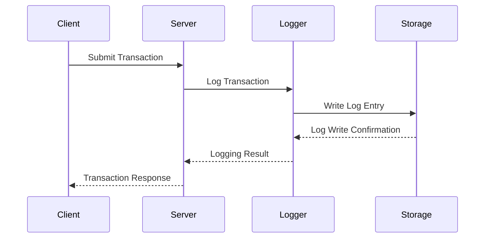

## Description

Transaction Logging is a critical design pattern focused on maintaining a comprehensive log of all transactions that occur within a system. These logs capture essential details of each transaction, ensuring that systems can be recovered after failures, audited for compliance, and analyzed for performance and optimization. Transaction logs provide the foundation for many security and operational processes, including data recovery, fraud detection, and system diagnostics.

## Architectural Approach

A well-implemented transaction logging system records all transaction data in a consistent, reliable, and durable manner. This typically involves:

1. **Consistency**: Ensuring that all transactions are recorded in the exact order they occur, supporting eventual reconciliation and replication.
   
2. **Durability**: Using reliable storage systems to guarantee that transaction logs are not lost during failures. Systems often use Write-Ahead Logging (WAL) in databases to ensure that all changes are logged before being committed.

3. **Scalability**: Designing logging frameworks that can scale with the system by using approaches like partitioning and event sourcing.

4. **Security and Compliance**: Implementing secure logging to prevent unauthorized access and meet regulation requirements, such as GDPR and HIPAA.

## Best Practices

- **Use Append-Only Logs**: Allow transactions to be appended always without modifying historical data, facilitating easier recovery and rollback operations.

- **Leverage Data Compression**: Compress logs to save storage space and allow faster transmission across networks when required.

- **Implement High Availability**: Use cloud storage solutions or distributed file systems for high availability and fault tolerance.

- **Data Retention Policies**: Define policies for how long transaction logs need to be retained based on business and compliance needs.

- **Incorporate Observability Tools**: Use tools that provide real-time insights and analytics over transaction logs for proactive monitoring and alerting.

## Example Code

Below is a simplified example of transaction logging in a Node.js application using JavaScript:

```javascript
const fs = require('fs');
const path = require('path');

class TransactionLogger {
  constructor(logFilePath) {
    this.logFile = path.join(__dirname, logFilePath);
  }

  logTransaction(transaction) {
    const logEntry = `${new Date().toISOString()} - ${JSON.stringify(transaction)}\n`;
    fs.appendFile(this.logFile, logEntry, (error) => {
      if (error) {
        console.error('Error logging transaction:', error);
      } else {
        console.log('Transaction logged successfully.');
      }
    });
  }
}

// Usage:
const transactionLogger = new TransactionLogger('transaction.log');
const transaction = {
  id: 'txn123',
  type: 'purchase',
  amount: 199.99,
  currency: 'USD',
};

transactionLogger.logTransaction(transaction);
```

## Diagrams

Here is a sequence diagram depicting the process of logging a transaction:



## Related Patterns

- **Write-Ahead Logging (WAL)**: A database-focused pattern that ensures logs are written before transaction commit.
- **Event Sourcing**: Records changes as a series of events for domain model states providing complete history and auditability.
- **Change Data Capture (CDC)**: Tracks changes in databases to ensure consistency and facilitate data streaming.

## Additional Resources

- [The Log: What every software engineer should know about real-time data's unifying abstraction](http://queue.acm.org/detail.cfm?id=2361116)
- [Event Sourcing Introduction](https://martinfowler.com/eaaDev/EventSourcing.html)
- [GDPR Compliance for Log Management](https://gdpr-info.eu/)

## Summary

Transaction Logging serves as a foundational practice for ensuring systems have reliable, recoverable, and auditable transaction logs, supporting an array of applications from troubleshooting to satisfying regulatory compliance. This pattern is fundamental in systems requiring robust data integrity, consistency, and durability. As an evolving area, its integration with modern cloud solutions provides enhanced capabilities for scaling and adapting to increasingly complex system architectures.
