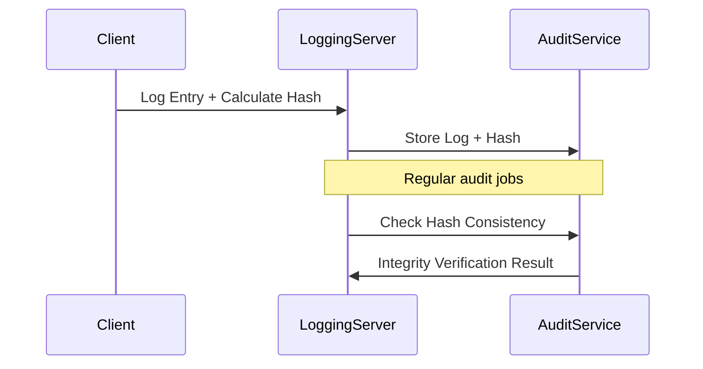

## Introduction

Log tamper detection encompasses strategies and techniques deployed to ensure the integrity and authenticity of logging data. In modern cloud computing environments, logs are pivotal in troubleshooting, security auditing, and operational monitoring. However, their importance also makes them a target for unauthorized alterations. Protecting logs from tamper threats can be achieved through various cryptographic methods, including digital signatures and checksums, as well as systematic audits. This pattern expounds on how to implement such mechanisms effectively.

## Description

The Log Tamper Detection pattern highlights different methodologies for detecting unauthorized alterations in log entries. The pattern is crucial for maintaining trustworthy audit trails and forensic readiness. By employing digital signatures or cryptographic checksums, systems can verify the authenticity and integrity of logs, alert administrators to discrepancies, and maintain trust in semi-trusted or hostile environments.

### Key Elements

- **Digital Signatures**: Each log entry or batch is digitally signed using asymmetric cryptography. Any alteration to the logs invalidates the signature, providing tamper evidence.
- **Checksums**: Generate a hash value for log data and store it securely. A change in the log will result in a different hash value.
- **Immutable Stores**: Utilizing append-only log stores or blockchain can prevent tampering and provide transparency.
- **Regular Audits**: Automatically align logs with their respective checksums or signatures as part of routine audits for early detection of discrepancies.

## Architectural Approaches

- **Server-Side Log Integrity**: Central servers apply signatures or checksums before storing logs. Regular audits occur to validate log consistency.
- **Client-Side Logging with Append-Only Stores**: Logs are collected at the client-side, signed, and sent to append-only storage mechanisms like append-only files or blockchains, where subsequent verification checks occur.
- **Blockchain for Logs**: Logs are stored and hashed on a blockchain, ensuring a tamper-evident history that is verifiable by all nodes in the network.

## Best Practices

1. **Centralized Logging System**: Log data should be centralized to manage easily and protect from localized threats.
2. **Use of Cryptography**: Employ strong cryptographic algorithms for hashing and signing logs.
3. **Access Control**: Limit the ability to modify logs to as few accounts and roles as necessary.
4. **Audit Trails**: Maintain separate audit trails that log access and modifications attempts to the log files.

## Example Code

Below is a Scala example demonstrating how to apply digital signatures to log entries:

```scala
import java.security._
import java.util.Base64
import javax.crypto.Cipher

object LogIntegrity {
  val keyPairGen: KeyPairGenerator = KeyPairGenerator.getInstance("RSA")
  keyPairGen.initialize(2048)
  val keyPair: KeyPair = keyPairGen.generateKeyPair()

  def signLog(logData: String): String = {
    val signature = Signature.getInstance("SHA256withRSA")
    signature.initSign(keyPair.getPrivate)
    signature.update(logData.getBytes)
    Base64.getEncoder.encodeToString(signature.sign())
  }

  def verifyLog(logData: String, signedData: String): Boolean = {
    val signature = Signature.getInstance("SHA256withRSA")
    signature.initVerify(keyPair.getPublic)
    signature.update(logData.getBytes)
    signature.verify(Base64.getDecoder.decode(signedData))
  }
}

// Example usage:
val logEntry = "User login at 2023-10-16 10:00:03"
val signedLog = LogIntegrity.signLog(logEntry)
val isVerified = LogIntegrity.verifyLog(logEntry, signedLog)
println(s"Verification status: $isVerified")
```

## Diagrams

### Sequence Diagram for Tamper Detection



## Related Patterns

- **Immutable Logging Pattern**: Store logs in an append-only format, preventing alteration post insertion.
- **Chain-of-Custody Pattern**: Maintain a detailed log of who, what, when modifications or log accesses occur.
- **Event Sourcing**: Captures all changes to an application state as a sequence of events, ensuring reconstitution and analysis.

## Additional Resources

- [AWS CloudTrail Best Practices](https://docs.aws.amazon.com/awscloudtrail/latest/userguide/best-practices-security.html)
- [Azure Monitor Logs](https://docs.microsoft.com/en-us/azure/azure-monitor/essentials/logs)
- [NIST Guidelines on Security and Privacy in Public Cloud](https://nvlpubs.nist.gov/nistpubs/SpecialPublications/NIST.SP.800-144.pdf)
  
## Summary

Incorporating log tamper detection aligns security goals with operational transparency, safeguarding sensitive data from unauthorized access and manipulation. By leveraging cryptographic techniques, immutable storage, and audit operations, organizations can enhance their overall security posture and ensure the reliability of their logging infrastructure. This pattern serves as a foundation for achieving robust log integrity in today's cloud environments.

