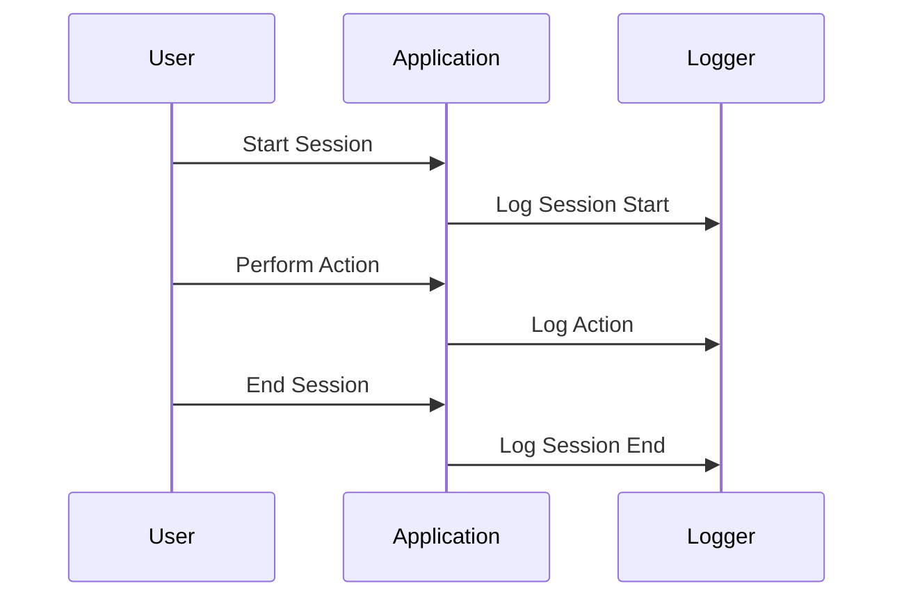

## Session Logging

Session Logging is a critical design pattern often used in audit logging to record the start and end of user sessions and capture user activities during these sessions. This design pattern is prevalent in various applications where user interactions, particularly those affecting state changes or accessing sensitive data, need to be tracked for security, auditing, or user experience optimization purposes.

### Description

Session Logging involves recording the details when a user session begins and ends. It serves to capture activities within a session, such as viewing specific pages, making transactions, or updating profile information. This logging provides a comprehensive view of user behavior and is essential for tracing any issues, auditing security compliance, or analyzing usage patterns.

### Key Elements of Session Logging

1. **Session Start**: Capture the timestamp, user ID, and initial user state or context when a session begins.
2. **Session Activities**: Record user interactions and activities along with timestamps during an active session.
3. **Session End**: Log the timestamp and final state or context when a session concludes.

### Benefits

- **Audit Trail**: Provides a comprehensive audit trail of user activities.
- **Security**: Enhances security by tracking suspicious activity patterns.
- **Performance Analysis**: Analyzes user behavior for performance tuning and user experience enhancements.

### Example

Consider a Java Spring Boot application that tracks user sessions for audit purposes. Below is a simplified example demonstrating how to log session details using an `Aspect` for capturing user activity.

```java
import org.aspectj.lang.annotation.Aspect;
import org.aspectj.lang.annotation.Before;
import org.aspectj.lang.annotation.After;
import org.slf4j.Logger;
import org.slf4j.LoggerFactory;
import org.springframework.stereotype.Component;

@Aspect
@Component
public class SessionLoggingAspect {

    private static final Logger logger = LoggerFactory.getLogger(SessionLoggingAspect.class);

    @Before("execution(* com.example.application.service.SomeService.startSession(..))")
    public void logSessionStart() {
        logger.info("Session started at: {}", System.currentTimeMillis());
    }

    @After("execution(* com.example.application.service.SomeService.endSession(..))")
    public void logSessionEnd() {
        logger.info("Session ended at: {}", System.currentTimeMillis());
    }

    @Before("execution(* com.example.application.service.SomeService.performAction(..)) && args(actionName)")
    public void logActivity(String actionName) {
        logger.info("Action performed: {} at: {}", actionName, System.currentTimeMillis());
    }
}
```

### Diagrams

Below is a sample Mermaid sequence diagram that illustrates the basic flow of session logging activities:



### Related Patterns

- **Event Logging**: Captures and stores events occurring within the software, complementary to session logging for tracing incidents.
- **Access Logging**: More granular than session logging, focusing on access to resources and information.

### Additional Resources

- [Spring AOP Documentation](https://docs.spring.io/spring-framework/docs/current/reference/html/aop.html)
- [Logback Project Homepage](https://logback.qos.ch/)

### Summary

Session Logging is a versatile and essential pattern for any system where trackability and accountability of user sessions are critical. It absolves potential compliance and security requirements while significantly benefiting application reliability analysis and user behavior studies. Proper implementation requires understanding user interaction pathways and integrating logging cleanly with minimal system performance impact.
