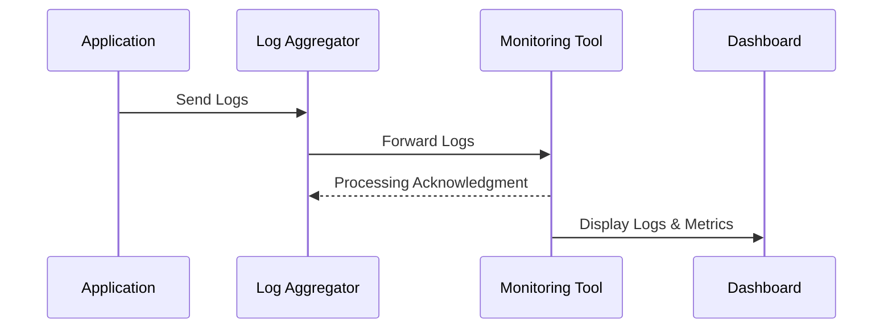

## Overview
Integration with monitoring tools involves feeding logs, metrics, and events into specialized platforms for real-time insights. This pattern supports operational visibility, proactive management, and improved response times by facilitating visualizations and alerts through dashboards.

## Architectural Approach

### Objectives
- Enable real-time monitoring and alerting.
- Improve operational transparency.
- Facilitate troubleshooting and performance optimization.

### Components
- **Log Aggregation Layer**: Collects logs from distributed services and aggregates them for processing.
- **Monitoring Tools**: Specialized platforms like Splunk, Grafana, Prometheus, or ELK Stack which consume logs and provide visualization and alerting capabilities.
- **Connector/Integration Layer**: Middleware that transforms logs/messages and sends them to the monitoring platform.

### Workflow
1. **Log Generation**: Applications and services generate logs.
2. **Log Transmission**: Logs are pushed to a centralized log aggregation service.
3. **Format Transformation**: Aggregated logs may need format conversion compatible with the monitoring tools.
4. **Ingestion**: Logs are ingested into monitoring tools where they are stored and indexed.
5. **Visualization & Alerting**: Monitoring tools provide dashboarding capabilities and alert configurations for real-time insights.

## Best Practices
- Ensure consistent and structured log formats to facilitate parsing and analysis.
- Use secure transport protocols (e.g., HTTPS, TLS) for log transmission to prevent interception.
- Implement rate limiting and batching to manage high volumes of log data efficiently.
- Set up retention policies to manage storage costs effectively.

## Example Code

```kotlin
import org.slf4j.Logger
import org.slf4j.LoggerFactory
import io.prometheus.client.exporter.HTTPServer
import io.prometheus.client.hotspot.DefaultExports

fun main() {
    val logger: Logger = LoggerFactory.getLogger("ExampleApp")
    DefaultExports.initialize() // Initialize JVM default metrics for Prometheus
    
    // Setup HTTP server for Prometheus to scrape metrics
    HTTPServer(1234)
    while (true) {
        logger.info("Emitting log: Application running smoothly")
        Thread.sleep(1000)
    }
}
```

This example demonstrates using the Prometheus JVM client library to export JVM metrics that can be scraped and monitored in real-time. Log4j is used to log application status.

## Diagrams



## Related Patterns
- **Centralized Logging**: Aggregate logs centrally for unified access and analysis.
- **Real-Time Monitoring**: Tools and techniques to continuously evaluate application performance.
- **Alerting**: Notify relevant stakeholders when specific conditions are met.

## Additional Resources
- [Introduction to Prometheus](https://prometheus.io/docs/introduction/overview/)
- [Grafana Documentation](https://grafana.com/docs/)
- [Splunk Observability](https://www.splunk.com/en_us/solutions/observability.html).

## Summary
Integration with monitoring tools is essential for maintaining operational oversight within distributed systems. By utilizing robust logging practices and connecting these logs with advanced monitoring solutions, organizations can empower their DevOps teams with tools necessary for performance optimization and rapid issue resolution.
