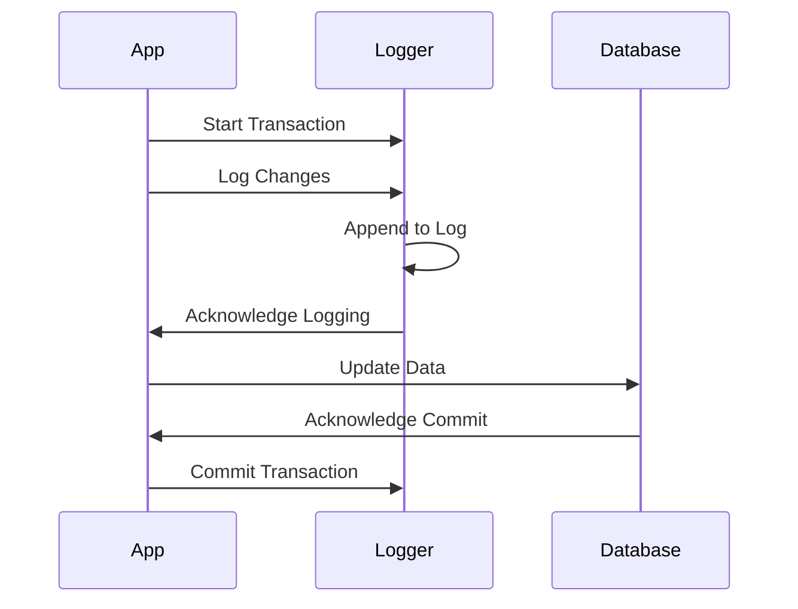

## Write-Ahead Logging

Write-Ahead Logging (WAL) is a foundational pattern in database systems used to enhance data integrity and fault tolerance. The core concept of WAL is to write any changes to a log file before applying those changes to the database. This ensures that there is a reliable record of changes that can be used to recover the database in case of a system crash or failure.

### Key Concepts

- **Pre-Commit Logging**: Before any data manipulation changes are committed to a database, they are first written to a log file. This log acts as a sequential record of changes, which can be replayed to reconstruct the database state.
  
- **Data Recovery**: In the event of a system failure, the log can be used to replay changes up to the last committed transaction, ensuring that no committed changes are lost.
  
- **Concurrency Control**: WAL often works in tandem with concurrency control mechanisms such as locks or MVCC (Multi-Version Concurrency Control) to manage access to the data during the transaction process.

### Benefits

- **Improved Fault Tolerance**: WAL allows for data recovery and reduces the risk of data corruption during unexpected failures.
  
- **Enhanced Performance**: By reducing the need to immediately synchronize all changes directly to the database disk, WAL can improve write performance.
  
- **Simplified Recovery Processes**: With a structured log of changes, databases can quickly restore to a consistent state without extensive manual intervention.

### Best Practices

- **Log Durability**: Ensure that the log is stored on a reliable and durable storage medium. Consider RAID configurations or cloud storage with redundancy.
  
- **Log Management**: Implement strategies for log rotation and management to prevent unbounded log growth, which can consume significant storage resources.
  
- **Testing Recovery Procedures**: Regularly test database recovery procedures to ensure that logs can indeed be used effectively for data restoration.

### Example Code

Here is a simplified example of how Write-Ahead Logging might be implemented:

```java
public class WriteAheadLogger {
    private final File logFile;
    
    public WriteAheadLogger(String filePath) {
        this.logFile = new File(filePath);
    }

    // Append an entry to the log
    public synchronized void logWrite(String transactionId, String data) throws IOException {
        try (FileWriter writer = new FileWriter(logFile, true)) {
            writer.write(transactionId + ": " + data + "\n");
        }
    }

    // Read log entries for recovery
    public List<String> readLog() throws IOException {
        List<String> logEntries = new ArrayList<>();
        try (BufferedReader reader = new BufferedReader(new FileReader(logFile))) {
            String line;
            while ((line = reader.readLine()) != null) {
                logEntries.add(line);
            }
        }
        return logEntries;
    }
}
```

### Diagrams

Below is a simple sequence diagram illustrating the WAL process:



### Related Patterns

- **Checkpointing**: Periodically take snapshots of the database state to minimize the amount of replaying of logs needed during recovery.
  
- **Event Sourcing**: Similar to WAL, but rather than maintaining a record for recovery after failures, event sourcing logs events so that the state of a system can be rebuilt or debugged at any point in time.

### Additional Resources

- [Database System Concepts by Silberschatz, Korth, Sudarshan](http://db-book.com/)
  
- [PostgreSQL Documentation on WAL](https://www.postgresql.org/docs/current/wal-intro.html)
  
- [SQL Server Transactions and WAL](https://docs.microsoft.com/en-us/sql/relational-databases/logs/the-transaction-log-sql-server)

### Summary

Write-Ahead Logging is a critical pattern for ensuring data integrity and reliability in the face of system faults and unexpected shutdowns. By logging changes before they are committed to the database, WAL allows for robust recovery mechanisms and supports high levels of transactional consistency. Adopting WAL along with effective log management practices enhances both the performance and resilience of database systems.
